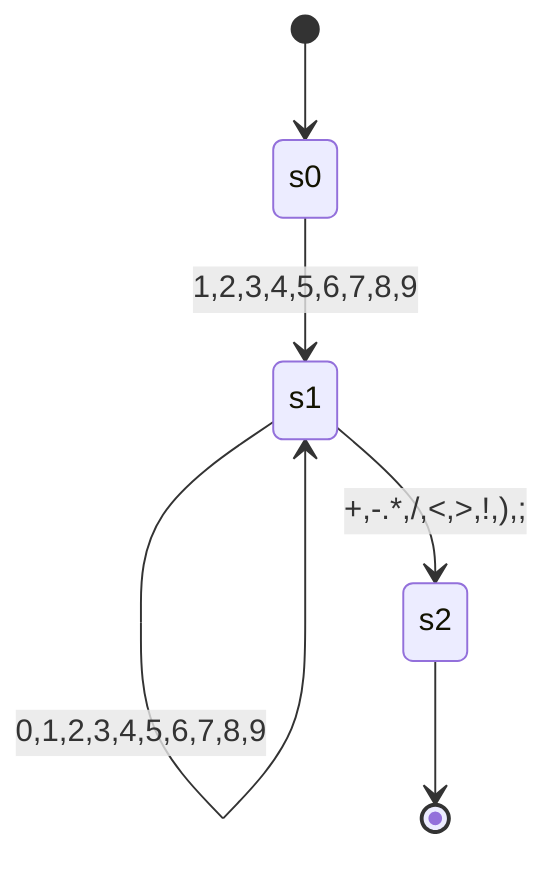
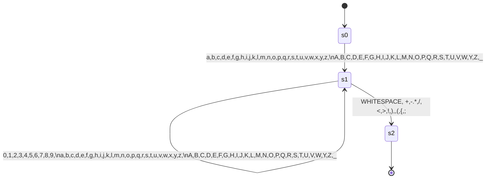

# Faul-Lang compiler

<!--toc:start-->
- [Faul-Lang compiler](#faul-lang-compiler)
  - [Usage](#usage)
  - [Aufbau](#aufbau)
    - [Vision](#vision)
  - [Sprache](#sprache)
    - [Regeln (Grammatik)](#regeln-grammatik)
    - [Operatorrangfolge](#operatorrangfolge)
    - [Token](#token)
      - [Basic](#basic)
      - [Keywords](#keywords)
      - [Operatoren](#operatoren)
  - [Compiler Phasen](#compiler-phasen)
    - [Frontend](#frontend)
      - [Input](#input)
      - [Lexer](#lexer)
      - [Parser](#parser)
      - [Semantische Analyse](#semantische-analyse)
    - [Backend](#backend)
      - [Programmoptimierung](#programmoptimierung)
      - [Codegenerierung](#codegenerierung)
        - [MIPS32](#mips32)
        - [Variablen-Register Strategie](#variablen-register-strategie)
        - [Generierte Code](#generierte-code)
  - [Finite State Machines](#finite-state-machines)
    - [Integer](#integer)
    - [Word](#word)
  - [Todo](#todo)
<!--toc:end-->

Ein kleiner compiler, der faul-lang in mips assembler übersetzt.

## Usage
```bash
faul-compiler -h
usage: faul-compiler <file> [options]
 -d,--debug       Create parse tree and abstract sytntax tree
 -h,--help        print this message
 -o,--out <arg>   Output file
```

## Aufbau
### Vision
Es soll erstmal zwei Datentypen geben, integer (int) und boolean (bool).

Damit soll möglich sein einfache Statements zu formulieren:
```c
int n = readI();
if(n <= 1) {
  print(false);
  exit();
}
int i = 2;
while(i<n){
  if(n % i == 0){
    print(false);
    exit();
  }
  i = i +1;
}
print(true);
```
Statements werden durch ein Semicolon terminiert.


## Sprache

### Regeln (Grammatik)

Es wird zu bezeichnung der Regeln die Backus-Naur-Form genutzt.

Im spezielleren wird der Syntax benutzt, der hier definiert ist: [BNF Playground](https://bnfplayground.pauliankline.com/?bnf=%3Cprogram%3E%20%20%20%20%20%20%20%20%20%20%20%3A%3A%3D%20%3Cstatement%3E%2a%0A%3Cstatement%3E%20%20%20%20%20%20%20%20%20%3A%3A%3D%20%22int%22%20%3Cident%3E%20%22%3D%22%20%3Cexpression%3E%20%3Csemi%3E%0A%20%20%20%20%20%20%20%20%20%20%20%20%20%20%20%20%20%20%20%20%20%20%7C%20%22bool%22%20%3Cident%3E%20%22%3D%22%20%3Cexpression%3E%20%3Csemi%3E%0A%20%20%20%20%20%20%20%20%20%20%20%20%20%20%20%20%20%20%20%20%20%20%7C%20%22if%22%20%22%28%22%20%3Cexpression%3E%20%22%29%22%20%22%7B%22%20%3Cstatement%3E%2a%20%22%7D%22%20%28%22else%22%20%22%7B%22%20%3Cstatement%3E%2a%20%22%7D%22%29%3F%0A%20%20%20%20%20%20%20%20%20%20%20%20%20%20%20%20%20%20%20%20%20%20%7C%20%22while%22%20%22%28%22%20%3Cexpression%3E%20%22%29%22%20%22%7B%22%20%3Cstatement%3E%2a%20%22%7D%22%0A%20%20%20%20%20%20%20%20%20%20%20%20%20%20%20%20%20%20%20%20%20%20%7C%20%3Cident%3E%20%22%3D%22%20%3Cexpression%3E%20%3Csemi%3E%0A%20%20%20%20%20%20%20%20%20%20%20%20%20%20%20%20%20%20%20%20%20%20%7C%20%3Cident%3E%20%3Cfunction_call%3E%20%3Csemi%3E%0A%3Cexpression%3E%20%20%20%20%20%20%20%20%3A%3A%3D%20%3Cequality%3E%20%28%20%28%22%26%26%22%20%7C%20%22%7C%7C%22%20%7C%20%22%26%22%20%7C%20%22%7C%22%29%20%3Cexpression%3E%29%3F%0A%3Cequality%3E%20%20%20%20%20%20%20%20%20%20%3A%3A%3D%20%3Ccomparision%3E%20%28%28%22%21%3D%22%20%7C%20%22%3D%3D%22%29%20%3Cequality%3E%29%3F%0A%3Ccomparision%3E%20%20%20%20%20%20%20%3A%3A%3D%20%3CarithmeticExpr%3E%20%28%20%28%22%3E%22%20%7C%20%22%3E%3D%22%20%7C%20%22%3C%22%20%7C%20%22%3C%3D%22%29%20%3Ccomparision%3E%29%3F%0A%3CarithmeticExpr%3E%20%20%20%20%3A%3A%3D%20%3Cterm%3E%20%28%28%20%22%2B%22%20%7C%20%22-%22%29%20%3CarithmeticExpr%3E%29%3F%0A%3Cterm%3E%20%20%20%20%20%20%20%20%20%20%20%20%20%20%3A%3A%3D%20%3Cunary%3E%20%28%28%22%2a%22%20%7C%20%22%2F%22%20%7C%20%22%25%22%29%20%3Cterm%3E%29%3F%0A%3Cunary%3E%20%20%20%20%20%20%20%20%20%20%20%20%20%3A%3A%3D%20%28%22%21%22%20%7C%20%22-%22%29%20%3Cunary%3E%0A%20%20%20%20%20%20%20%20%20%20%20%20%20%20%20%20%20%20%20%20%20%20%7C%20%3Cprimary%3E%0A%3Cprimary%3E%20%20%20%20%20%20%20%20%20%20%20%3A%3A%3D%20%3Cvbool%3E%20%7C%20%3Cvint%3E%20%7C%20%3Cident%3E%0A%20%20%20%20%20%20%20%20%20%20%20%20%20%20%20%20%20%20%20%20%20%20%7C%20%22%28%22%20%3Cexpression%3E%20%22%29%22%0A%3Cvbool%3E%20%20%20%20%20%20%20%20%20%20%20%20%20%3A%3A%3D%20%22true%22%20%7C%20%22false%22%0A%3Cvint%3E%20%20%20%20%20%20%20%20%20%20%20%20%20%20%3A%3A%3D%20%5B1-9%5D%20%5B0-9%5D%2a%0A%20%20%20%20%20%20%20%20%20%20%20%20%20%20%20%20%20%20%20%20%20%20%7C%20%220%22%0A%3Cident%3E%20%20%20%20%20%20%20%20%20%20%20%20%20%3A%3A%3D%20%28%22_%22%20%7C%20%5Ba-z%5D%29%20%28%22_%22%20%7C%20%5Ba-z%5D%20%7C%20%5B0-9%5D%29%2a%20%28%3Cfunction_call%3E%29%3F%0A%3Cfunction_call%3E%20%20%20%20%20%3A%3A%3D%20%22%28%22%20%28%3Cexpression%3E%20%28%22,%22%20%3Cexpression%3E%29%2a%29%3F%20%22%29%22%0A%3Csemi%3E%20%20%20%20%20%20%20%20%20%20%20%20%20%20%3A%3A%3D%20%22%3B%22%2B%0A&name=faul-lang).

```
<program>           ::= <statement>*
<statement>         ::= "int" <ident> "=" <expression> <semi>
                      | "bool" <ident> "=" <expression> <semi>
                      | "if" "(" <expression> ")" "{" <statement>* "}" ("else" "{" <statement>* "}")?
                      | "while" "(" <expression> ")" "{" <statement>* "}"
                      | <ident> "=" <expression> <semi>
                      | <ident> <function_call> <semi>
<expression>        ::= <equality> ( ("&&" | "||" | "&" | "|") <expression>)?
<equality>          ::= <comparision> (("!=" | "==") <equality>)?
<comparision>       ::= <arithmeticExpr> ( (">" | ">=" | "<" | "<=") <comparision>)?
<arithmeticExpr>    ::= <term> (( "+" | "-") <arithmeticExpr>)?
<term>              ::= <unary> (("*" | "/" | "%") <term>)?
<unary>             ::= ("!" | "-") <unary>
                      | <primary>
<primary>           ::= <vbool> | <vint> | <ident>
                      | "(" <expression> ")"
<vbool>             ::= "true" | "false"
<vint>              ::= [1-9] [0-9]*
                      | "0"
<ident>             ::= ("_" | [a-z]) ("_" | [a-z] | [0-9])* (<function_call>)?
<function_call>     ::= "(" (<expression> ("," <expression>)*)? ")"
<semi>              ::= ";"+


```

### Operatorrangfolge

1. Funktionsaufrufe
2. Klammerungen
3. `-` `!`
4. `*` `/`
5. `+` `-`
6. `>` `>=` `<` `<=`
7. `&&` `||` `|` `&`

### Token 
Tokens der Faul-Lang.
#### Basic

| Name              | Beschreibung             |
|-------------------|:-------------------------|
| EOF               | Ende des Inputs          |
| SEMICOLON         | Statements terminator    |
| V_INT             | Ganzzahl                 |
| V_BOOL            | Boolescher Wahrheitswert |
| OPEN_PARENTHESES  | {                        |
| CLOSE_PARENTHESES | }                        |
| IDENT             | Variablenname            |

#### Keywords

| Name  | Beschreibung                 |
|-------|------------------------------|
| INT   | Zum erstellen eines Integers |
| BOOL  | Zum erstellen eines Boolean  |
| IF    | Beginnt ein If-Statement     |
| ELSE  | Beginnt ein ELSE-Statement   |
| WHILE | Beginnt ein While-Statement  |

#### Operatoren

| Name          |     Beschreibung      |
|:--------------|:---------------------:|
| EQ            |           =           |
| PLUS          |           +           |
| MINUS         |           -           |
| ASTERISK      |           *           |
| SLASH         |           /           |
| OR            |  \| (Bitweises oder)  |
| AND           |  & (Bitweises  und)   |
| EQEQ          |          ==           | 
| NOTEQ         |          !=           |
| GT            |           >           |
| GTEQ          |          >=           |
| LT            |           <           |
| LTEQ          |          <=           |
| LOR           | \|\| (logischer oder) |
| LAND          |  && (logisches und)   |
| NOT           |           !           |
| OPEN_BRACKET  |           (           |
| CLOSE_BRACKET |           )           |


## Compiler Phasen

### Frontend

#### Input

```c
int n = readI();
if(n <= 1) {
  print(false);
  exit();
}
int i = 2;
while(i<n){
  if(n % i == 0){
    print(false);
    exit();
  }
  i = i +1;
}
print(true);
```

#### Lexer
Der Lexer geneiert aus dem [Input](#input) ein stream an [Token](#token)

#### Parser

Der Parser verarbeitet den [Token-Stream](#token) und gibt einen Parse Tree aus. Hierbei wird auch auf Syntaxfehler hin überprüft.

Dieser lässt sich durch die toString Methode beispielsweise so ausgeben:

```
Parse Tree (Syntax Tree)

PROGRAM
├── STATEMENT
│   ├── IDENT: n
│   ├── EQ: =
│   ├── EXPRESSION
│   │   └── EQUALITY
│   │       └── COMPARISON
│   │           └── ARITHMETIC_EXPR
│   │               └── TERM
│   │                   └── UNARY
│   │                       └── PRIMARY
│   │                           ├── IDENT: readI
│   │                           └── FUNC_CALL
│   └── SEMICOLON: ;
├── STATEMENT
│   ├── IF: if
│   ├── OPEN_BRACKET: (
│   ├── EXPRESSION
│   │   └── EQUALITY
│   │       └── COMPARISON
│   │           ├── ARITHMETIC_EXPR
│   │           │   └── TERM
│   │           │       └── UNARY
│   │           │           └── PRIMARY
│   │           │               └── IDENT: n
│   │           ├── LTEQ: <=
│   │           └── COMPARISON
│   │               └── ARITHMETIC_EXPR
│   │                   └── TERM
│   │                       └── UNARY
│   │                           └── PRIMARY
│   │                               └── V_INT: 1
│   ├── CLOSE_BRACKET: )
│   ├── OPEN_PARANTHESES: {
│   ├── STATEMENT
│   │   ├── IDENT: print
│   │   ├── FUNC_CALL
│   │   │   └── EXPRESSION
│   │   │       └── EQUALITY
│   │   │           └── COMPARISON
│   │   │               └── ARITHMETIC_EXPR
│   │   │                   └── TERM
│   │   │                       └── UNARY
│   │   │                           └── PRIMARY
│   │   │                               └── V_BOOL: false
│   │   └── SEMICOLON: ;
│   ├── STATEMENT
│   │   ├── IDENT: exit
│   │   ├── FUNC_CALL
│   │   └── SEMICOLON: ;
│   └── CLOSE_PARANTHESES: }
├── STATEMENT
│   ├── IDENT: i
│   ├── EQ: =
│   ├── EXPRESSION
│   │   └── EQUALITY
│   │       └── COMPARISON
│   │           └── ARITHMETIC_EXPR
│   │               └── TERM
│   │                   └── UNARY
│   │                       └── PRIMARY
│   │                           └── V_INT: 2
│   └── SEMICOLON: ;
├── STATEMENT
│   ├── WHILE: while
│   ├── OPEN_BRACKET: (
│   ├── EXPRESSION
│   │   └── EQUALITY
│   │       └── COMPARISON
│   │           ├── ARITHMETIC_EXPR
│   │           │   └── TERM
│   │           │       └── UNARY
│   │           │           └── PRIMARY
│   │           │               └── IDENT: i
│   │           ├── LT: <
│   │           └── COMPARISON
│   │               └── ARITHMETIC_EXPR
│   │                   └── TERM
│   │                       └── UNARY
│   │                           └── PRIMARY
│   │                               └── IDENT: n
│   ├── CLOSE_BRACKET: )
│   ├── OPEN_PARANTHESES: {
│   ├── STATEMENT
│   │   ├── IF: if
│   │   ├── OPEN_BRACKET: (
│   │   ├── EXPRESSION
│   │   │   └── EQUALITY
│   │   │       ├── COMPARISON
│   │   │       │   └── ARITHMETIC_EXPR
│   │   │       │       └── TERM
│   │   │       │           ├── UNARY
│   │   │       │           │   └── PRIMARY
│   │   │       │           │       └── IDENT: n
│   │   │       │           ├── PERCENT: %
│   │   │       │           └── TERM
│   │   │       │               └── UNARY
│   │   │       │                   └── PRIMARY
│   │   │       │                       └── IDENT: i
│   │   │       ├── EQEQ: ==
│   │   │       └── EQUALITY
│   │   │           └── COMPARISON
│   │   │               └── ARITHMETIC_EXPR
│   │   │                   └── TERM
│   │   │                       └── UNARY
│   │   │                           └── PRIMARY
│   │   │                               └── V_INT: 0
│   │   ├── CLOSE_BRACKET: )
│   │   ├── OPEN_PARANTHESES: {
│   │   ├── STATEMENT
│   │   │   ├── IDENT: print
│   │   │   ├── FUNC_CALL
│   │   │   │   └── EXPRESSION
│   │   │   │       └── EQUALITY
│   │   │   │           └── COMPARISON
│   │   │   │               └── ARITHMETIC_EXPR
│   │   │   │                   └── TERM
│   │   │   │                       └── UNARY
│   │   │   │                           └── PRIMARY
│   │   │   │                               └── V_BOOL: false
│   │   │   └── SEMICOLON: ;
│   │   ├── STATEMENT
│   │   │   ├── IDENT: exit
│   │   │   ├── FUNC_CALL
│   │   │   └── SEMICOLON: ;
│   │   └── CLOSE_PARANTHESES: }
│   ├── STATEMENT
│   │   ├── IDENT: i
│   │   ├── EQ: =
│   │   ├── EXPRESSION
│   │   │   └── EQUALITY
│   │   │       └── COMPARISON
│   │   │           └── ARITHMETIC_EXPR
│   │   │               ├── TERM
│   │   │               │   └── UNARY
│   │   │               │       └── PRIMARY
│   │   │               │           └── IDENT: i
│   │   │               ├── PLUS: +
│   │   │               └── ARITHMETIC_EXPR
│   │   │                   └── TERM
│   │   │                       └── UNARY
│   │   │                           └── PRIMARY
│   │   │                               └── V_INT: 1
│   │   └── SEMICOLON: ;
│   └── CLOSE_PARANTHESES: }
└── STATEMENT
    ├── IDENT: print
    ├── FUNC_CALL
    │   └── EXPRESSION
    │       └── EQUALITY
    │           └── COMPARISON
    │               └── ARITHMETIC_EXPR
    │                   └── TERM
    │                       └── UNARY
    │                           └── PRIMARY
    │                               └── V_BOOL: true
    └── SEMICOLON: ;
```
#### Semantische Analyse

Oftmals wird gar kein Parse Tree erstellt sondern direkt ein abstrakter Syntax Baum (AST). 
Dieser Compiler tut dies aus Gründen der Simplizität nicht. Die [AbstractSyntaxTreeFactory](src/main/java/ast/AbstractSyntaxTreeFactory.java) verarbeitet den [Parse Tree](#parse-tree-syntax-tree) zu einem AST.

Dieser lässt sich auch mit der Methode toString() wie folgt ausgeben:


```
Abstract Syntax Tree

PROGRAM, Type: T: VOID; rT: null,  Position: 0:0
├── DECLARATION, Type: T: VOID; rT: VOID,  Position: 1:1
│   ├── IDENT: n, Type: T: VAR; rT: INTEGER,  Position: 1:5
│   └── ADDRESS: 4, Type: T: MEMORY_ADDRESS; rT: MEMORY_ADDRESS,  Position: 1:5
├── ASSIGNMENT, Type: T: INTEGER; rT: VOID,  Position: 1:9
│   ├── IDENT: n, Type: T: VAR; rT: INTEGER,  Position: 1:5
│   └── FUNC_CALL, Type: T: FUNCTION; rT: INTEGER,  Position: 1:9
│       └── IDENT: readI, Type: T: INTEGER; rT: FUNCTION,  Position: 1:9
├── IF, Type: T: VOID; rT: VOID,  Position: 2:1
│   ├── CONDITION, Type: T: BOOLEAN; rT: VOID,  Position: 2:4
│   │   └── LTEQ, Type: T: INTEGER; rT: BOOLEAN,  Position: 2:6
│   │       ├── IDENT: n, Type: T: VAR; rT: INTEGER,  Position: 2:4
│   │       └── INTEGER: 1, Type: T: INTEGER; rT: INTEGER,  Position: 2:9
│   └── BRANCH, Type: T: VOID; rT: VOID,  Position: 2:1
│       ├── FUNC_CALL, Type: T: FUNCTION; rT: VOID,  Position: 3:3
│       │   ├── IDENT: print, Type: T: VOID; rT: FUNCTION,  Position: 3:3
│       │   └── PARAM, Type: T: VOID; rT: FUNCTION,  Position: 3:9
│       │       └── BOOLEAN: false, Type: T: BOOLEAN; rT: BOOLEAN,  Position: 3:9
│       └── FUNC_CALL, Type: T: FUNCTION; rT: VOID,  Position: 4:3
│           └── IDENT: exit, Type: T: VOID; rT: FUNCTION,  Position: 4:3
├── DECLARATION, Type: T: VOID; rT: VOID,  Position: 6:1
│   ├── IDENT: i, Type: T: VAR; rT: INTEGER,  Position: 6:5
│   └── ADDRESS: 5, Type: T: MEMORY_ADDRESS; rT: MEMORY_ADDRESS,  Position: 6:5
├── ASSIGNMENT, Type: T: INTEGER; rT: VOID,  Position: 6:9
│   ├── IDENT: i, Type: T: VAR; rT: INTEGER,  Position: 6:5
│   └── INTEGER: 2, Type: T: INTEGER; rT: INTEGER,  Position: 6:9
├── WHILE, Type: T: VOID; rT: VOID,  Position: 7:1
│   ├── CONDITION, Type: T: BOOLEAN; rT: VOID,  Position: 7:7
│   │   └── LT, Type: T: INTEGER; rT: BOOLEAN,  Position: 7:8
│   │       ├── IDENT: i, Type: T: VAR; rT: INTEGER,  Position: 7:7
│   │       └── IDENT: n, Type: T: VAR; rT: INTEGER,  Position: 7:9
│   └── BRANCH, Type: T: VOID; rT: VOID,  Position: 7:1
│       ├── IF, Type: T: VOID; rT: VOID,  Position: 8:3
│       │   ├── CONDITION, Type: T: BOOLEAN; rT: VOID,  Position: 8:6
│       │   │   └── EQEQ, Type: T: INTEGER; rT: BOOLEAN,  Position: 8:12
│       │   │       ├── MOD, Type: T: INTEGER; rT: INTEGER,  Position: 8:8
│       │   │       │   ├── IDENT: n, Type: T: VAR; rT: INTEGER,  Position: 8:6
│       │   │       │   └── IDENT: i, Type: T: VAR; rT: INTEGER,  Position: 8:10
│       │   │       └── INTEGER: 0, Type: T: INTEGER; rT: INTEGER,  Position: 8:15
│       │   └── BRANCH, Type: T: VOID; rT: VOID,  Position: 8:3
│       │       ├── FUNC_CALL, Type: T: FUNCTION; rT: VOID,  Position: 9:5
│       │       │   ├── IDENT: print, Type: T: VOID; rT: FUNCTION,  Position: 9:5
│       │       │   └── PARAM, Type: T: VOID; rT: FUNCTION,  Position: 9:11
│       │       │       └── BOOLEAN: false, Type: T: BOOLEAN; rT: BOOLEAN,  Position: 9:11
│       │       └── FUNC_CALL, Type: T: FUNCTION; rT: VOID,  Position: 10:5
│       │           └── IDENT: exit, Type: T: VOID; rT: FUNCTION,  Position: 10:5
│       └── ASSIGNMENT, Type: T: INTEGER; rT: VOID,  Position: 12:3
│           ├── IDENT: i, Type: T: VAR; rT: INTEGER,  Position: 12:3
│           └── PLUS, Type: T: INTEGER; rT: INTEGER,  Position: 12:9
│               ├── IDENT: i, Type: T: VAR; rT: INTEGER,  Position: 12:7
│               └── INTEGER: 1, Type: T: INTEGER; rT: INTEGER,  Position: 12:10
└── FUNC_CALL, Type: T: FUNCTION; rT: VOID,  Position: 14:1
    ├── IDENT: print, Type: T: VOID; rT: FUNCTION,  Position: 14:1
    └── PARAM, Type: T: VOID; rT: FUNCTION,  Position: 14:7
        └── BOOLEAN: true, Type: T: BOOLEAN; rT: BOOLEAN,  Position: 14:7

```

### Backend

#### Programmoptimierung

Zururzeit finden keine großen optimierungen. Leere "else"-Statements werden ignoriert.

Mögliche optimierungen wären jedoch: 

- Plus und Minus `0` ignorieren
- Term `0` setzen wenn sie mit Null multipliziert werden
- Bei Ausdrücken die immer `true` bzw. `false` sind nicht branchen oder Branch entfernen
- Statische variablen mit ihrem Value ersetzen

#### Codegenerierung

Die Codegenerierung findet naiv über das Traversieren des AST statt. Bei `Expressions` wird ein modifizierter Depth-first search (DFS) eingetzt um sie in der richtigen Reihenfolge zu evaluieren.
Der DFS ist so angepasst, dass er statt immer den linken oder rechten Ast des Binary Trees zu erst zu besuchen, den wählt, der tiefer ist. Dies führt dazu, dass nie mehr als zwei Zwischenergebnis Register benötigt werden.

##### MIPS32

Der genierierte Code ist MIPS32 Assembler. [MIPS32 Instruction Set Quick Reference](https://s3-eu-west-1.amazonaws.com/downloads-mips/documents/MD00565-2B-MIPS32-QRC-01.01.pdf)

Zum ausführen kann [MARS MIPS simulator - Missouri State University](https://courses.missouristate.edu/KenVollmar/MARS/) genutzt werden. Dieser unterstützt auch einige Pseudo Instructions, wie zum Beispiel `li`.


##### Variablen-Register Strategie

Die Register $s0 - $s7 sind per Konvention dazu da, Werte über lange Zeit zu speichern. Prozeduren, also funktionen müssen (bzw. sollten) diese vor dem return wiederherstellen. Daher werden dort geladene Variablen gespeichert.

Natürlich können in einem Pogramm mehr als acht Variablen existieren, weshalb es eine Strategie geben muss, nach der entschieden wird wann welche Variable in welches Register geladen wird und wann sie in den Speicher gescrhieben wird.

Wenn eine Variable benötigt wird, sie nicht bereits in einem Register steht und alle Register belegt sind, wird die Variable, die am längsten nicht mehr genutzt wurde, in den Speicher verschoben. Danach ist ein Register frei für die Variable. 

##### Generierte Code


```asm
main:
# initializing s0 with address 16
		move $s0, $0
		jal readI
		nop
# Assgining reg s0 with address 4
		move $s0, $v0
# If start
# Loading value 1
		li $t0, 1
# Less than equals
		sle $t0, $s0, $t0
		beqz $t0, label_0
		nop
# Loading value 0
		li $t1, 0
		move $a0, $t1
		jal print
		nop
		jal exit
		nop
# If end
label_0:
# initializing s1 with address 20
		move $s1, $0
		addi $s1, $0, 2
# While start
label_2:
# Less than
		slt $t1, $s1, $s0
		beqz $t1, label_1
		nop
# If start
# Modulo
		div $s0, $s1
		mfhi $t2
# Loading value 0
		li $t3, 0
# Equals
		seq $t2, $t2, $t3
		beqz $t2, label_3
		nop
# Loading value 0
		li $t3, 0
		move $a0, $t3
		jal print
		nop
		jal exit
		nop
# If end
label_3:
# Loading value 1
		li $t3, 1
		add $t3, $s1, $t3
# Assgining reg s1 with address 5
		move $s1, $t3
		b label_2
		nop
# While end
label_1:
# Loading value 1
		li $t3, 1
		move $a0, $t3
		jal print
		nop
# unloading all vars
# unloading s0 and storing in address 16
		sw $s0, 16($gp)
# unloading s1 and storing in address 20
		sw $s1, 20($gp)
# Exit
		li $v0, 10
		syscall
readI:
		addi $sp, $sp, -4
		sw $ra, 0($sp)
		li $v0, 5
		syscall
		nop
		lw $ra, 0($sp)
		addi $sp, $sp, 4
		jr $ra
		nop
readB:
		addi $sp, $sp, -4
		sw $ra, 0($sp)
		li $v0, 5
		syscall
		nop
		andi $v0, $v0, 1
		lw $ra, 0($sp)
		addi $sp, $sp, 4
		jr $ra
		nop
print:
		addi $sp, $sp, -4
		sw $ra, 0($sp)
		li $v0, 1
		syscall
		nop
		lw $ra, 0($sp)
		addi $sp, $sp, 4
		jr $ra
		nop
exit:
# Exit
		li $v0, 10
		syscall

```


## Finite State Machines

### Integer


### Word



## Todo
- [X] Lexer
- [x] Parser
- [x] Abstract Syntax Tree (AST)
- [X] Semantische Analyse
  - Typechecking
  - ~~Optimierung~~
- [X] Code generation
