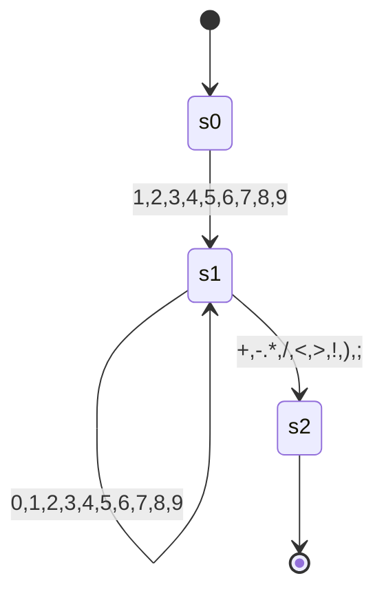
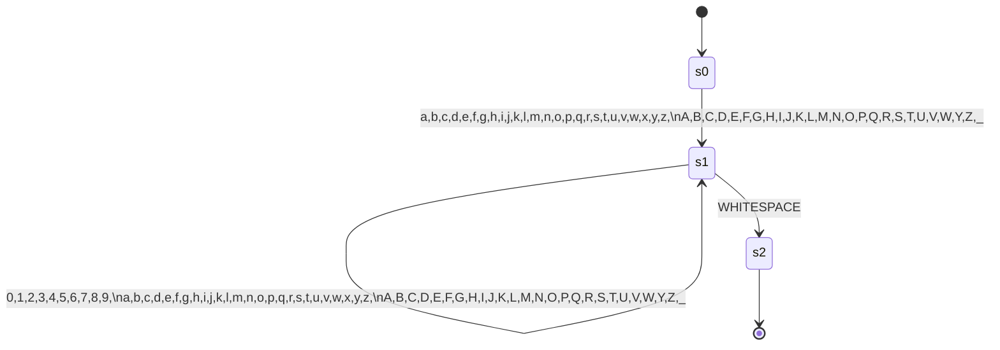

<!-- TOC -->
* [Faul-Lang compiler](#faul-lang-compiler)
  * [Aufbau](#aufbau)
    * [Vision](#vision)
    * [Token](#token)
      * [Basic](#basic)
      * [Keywords](#keywords)
      * [Operatoren](#operatoren)
  * [Finite State Machines](#finite-state-machines)
    * [Integer](#integer)
  * [Todo](#todo)
<!-- TOC -->
# Faul-Lang compiler
Ein kleiner compiler, der faul-lang in mips assembler übersetzt.

## Aufbau
### Vision
Es soll erstmal zwei Datentypen geben, integer (int) und boolean (bool).

Damit soll möglich sein einfach Statements zu formulieren:
```
    int a = 3 + 5;
    int d = 3 * a:
    
    bool b = true;
    bool c = !b
```
Statements werden durch ein Semicolon terminiert.

Block-Statements sind auch geplant. Zunächst soll dies nur `if` beinhalten.

### Token
Tokens der Faul-Lang.
#### Basic

| Name              | Beschreibung             |
|-------------------|:-------------------------|
| EOF               | Ende des Inputs          |
| SEMICOLON         | Statements terminator    |
| V_INT             | Ganzzahl                 |
| V_BOOL            | Boolescher Wahrheitswert |
| OPEN_PARENTHESES  | {                        |
| CLOSE_PARENTHESES | }                        |
| IDENT             | Variablenname            |

#### Keywords

| Name | Beschreibung                 |
|------|------------------------------|
| INT  | Zum erstellen eines Integers |
| BOOL | Zum erstellen eines Boolean  |
| IF   | Beginnt ein If-Statement     |

#### Operatoren

| Name          | Beschreibung |
|:--------------|:------------:|
| EQ            |      =       |
| PLUS          |      +       |
| MINUS         |      -       |
| ASTERISK      |      *       |
| SLASH         |      /       |
| EQEQ          |      ==      | 
| NOTEQ         |      !=      |
| GT            |      >       |
| GTEQ          |      >=      |
| LT            |      <       |
| LTEQ          |      <=      |
| NOT           |      !       |
| OPEN_BRACKET  |      (       |
| CLOSE_BRACKET |      )       |

## Finite State Machines

### Integer


### Word



## Todo
- [ ] Lexer
- [ ] Parser
- [ ] Code generation
