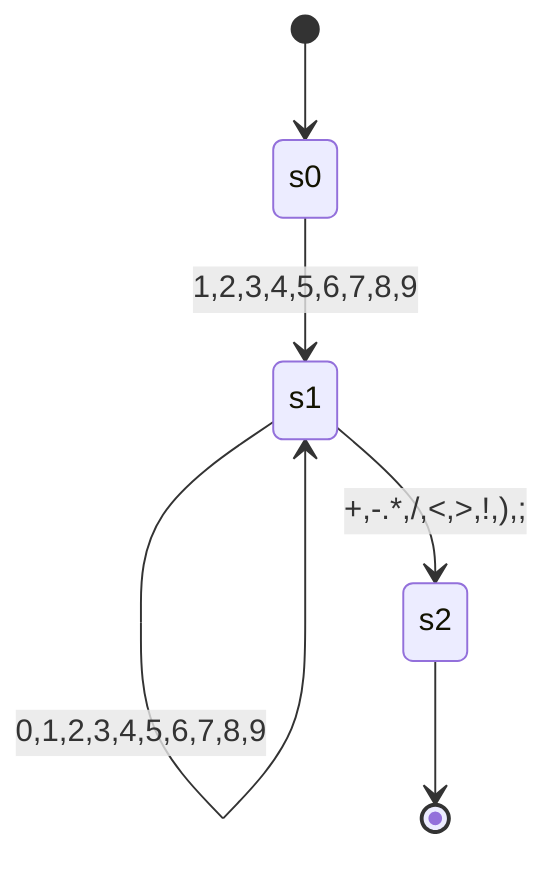
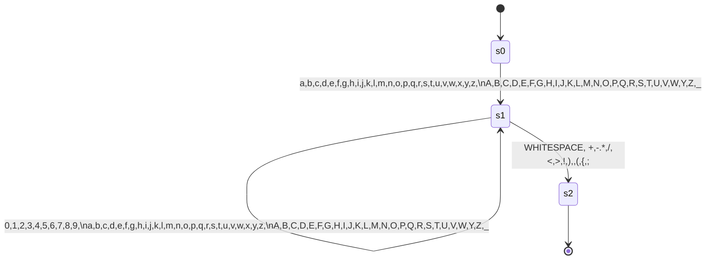

# Faul-Lang compiler

<!--toc:start-->
- [Faul-Lang compiler](#faul-lang-compiler)
  - [Usage](#usage)
  - [Build](#build)
    - [Building the executable](#building-the-executable)
    - [Linux/Mac](#linuxmac)
    - [Windows](#windows)
  - [Running Examples](#running-examples)
  - [Structure](#structure)
    - [Vision](#vision)
  - [Language](#language)
    - [Rules (Grammar)](#rules-grammar)
    - [Operator Precedence](#operator-precedence)
    - [Tokens](#tokens)
      - [Basic](#basic)
      - [Keywords](#keywords)
      - [Operators](#operators)
  - [Compiler Phases](#compiler-phases)
    - [Frontend](#frontend)
      - [Input](#input)
      - [Lexer](#lexer)
      - [Parser](#parser)
      - [Semantic Analysis](#semantic-analysis)
    - [Backend](#backend)
      - [Program Optimization](#program-optimization)
      - [Code Generation](#code-generation)
        - [MIPS32](#mips32)
        - [Variable-Register Strategy](#variable-register-strategy)
        - [Generated Code](#generated-code)
  - [Finite State Machines](#finite-state-machines)
    - [Integer](#integer)
    - [Word](#word)
  - [Todo](#todo)
<!--toc:end-->

A small compiler that translates faul-lang into MIPS assembly.

## Usage
```bash
faul-compiler -h
usage: faul-compiler <file> [options]
 -d,--debug       Create parse tree and abstract sytntax tree
 -h,--help        print this message
 -o,--out <arg>   Output file

```

## Build

### Building the executable

```bash
chmod +x ./src/test/resources/Mars4_5.jar
mvn clean package

```

### Linux/Mac

```bash
./target/faul-compiler

```

### Windows

```bash
java -jar ./target/faul-compiler

```

## Running Examples

```bash
./target/faul-compiler examples/fibonacci.faul
java -jar ./src/test/resources/Mars4_5.jar examples/fibonacci.asm

```

## Structure

### Vision

Initially, there should be two data types: integer (int) and boolean (bool).

This should make it possible to formulate simple statements:

```c
int n = readI();
if(n <= 1) {
  print(false);
  exit();
}
int i = 2;
while(i<n){
  if(n % i == 0){
    print(false);
    exit();
  }
  i = i +1;
}
print(true);

```

Statements are terminated by a semicolon.

## Language

### Rules (Grammar)

Backus-Naur Form (BNF) is used to denote the rules.

More specifically, the syntax defined here is used: [BNF Playground](https://bnfplayground.pauliankline.com/?bnf=%3Cprogram%3E%20%20%20%20%20%20%20%20%20%20%20%3A%3A%3D%20%3Cstatement%3E%2a%0A%3Cstatement%3E%20%20%20%20%20%20%20%20%20%3A%3A%3D%20%22int%22%20%3Cident%3E%20%22%3D%22%20%3Cexpression%3E%20%3Csemi%3E%0A%20%20%20%20%20%20%20%20%20%20%20%20%20%20%20%20%20%20%20%20%20%20%7C%20%22bool%22%20%3Cident%3E%20%22%3D%22%20%3Cexpression%3E%20%3Csemi%3E%0A%20%20%20%20%20%20%20%20%20%20%20%20%20%20%20%20%20%20%20%20%20%20%7C%20%22if%22%20%22%28%22%20%3Cexpression%3E%20%22%29%22%20%22%7B%22%20%3Cstatement%3E%2a%20%22%7D%22%20%28%22else%22%20%22%7B%22%20%3Cstatement%3E%2a%20%22%7D%22%29%3F%0A%20%20%20%20%20%20%20%20%20%20%20%20%20%20%20%20%20%20%20%20%20%20%7C%20%22while%22%20%22%28%22%20%3Cexpression%3E%20%22%29%22%20%22%7B%22%20%3Cstatement%3E%2a%20%22%7D%22%0A%20%20%20%20%20%20%20%20%20%20%20%20%20%20%20%20%20%20%20%20%20%20%7C%20%3Cident%3E%20%22%3D%22%20%3Cexpression%3E%20%3Csemi%3E%0A%20%20%20%20%20%20%20%20%20%20%20%20%20%20%20%20%20%20%20%20%20%20%7C%20%3Cident%3E%20%3Cfunction_call%3E%20%3Csemi%3E%0A%3Cexpression%3E%20%20%20%20%20%20%20%20%3A%3A%3D%20%3Cequality%3E%20%28%20%28%22%26%26%22%20%7C%20%22%7C%7C%22%20%7C%20%22%26%22%20%7C%20%22%7C%22%29%20%3Cexpression%3E%29%3F%0A%3Cequality%3E%20%20%20%20%20%20%20%20%20%20%3A%3A%3D%20%3Ccomparision%3E%20%28%28%22%21%3D%22%20%7C%20%22%3D%3D%22%29%20%3Cequality%3E%29%3F%0A%3Ccomparision%3E%20%20%20%20%20%20%20%3A%3A%3D%20%3CarithmeticExpr%3E%20%28%20%28%22%3E%22%20%7C%20%22%3E%3D%22%20%7C%20%22%3C%22%20%7C%20%22%3C%3D%22%29%20%3Ccomparision%3E%29%3F%0A%3CarithmeticExpr%3E%20%20%20%20%3A%3A%3D%20%3Cterm%3E%20%28%28%20%22%2B%22%20%7C%20%22-%22%29%20%3CarithmeticExpr%3E%29%3F%0A%3Cterm%3E%20%20%20%20%20%20%20%20%20%20%20%20%20%20%3A%3A%3D%20%3Cunary%3E%20%28%28%22%2a%22%20%7C%20%22%2F%22%20%7C%20%22%25%22%29%20%3Cterm%3E%29%3F%0A%3Cunary%3E%20%20%20%20%20%20%20%20%20%20%20%20%20%3A%3A%3D%20%28%22%21%22%20%7C%20%22-%22%29%20%3Cunary%3E%0A%20%20%20%20%20%20%20%20%20%20%20%20%20%20%20%20%20%20%20%20%20%20%7C%20%3Cprimary%3E%0A%3Cprimary%3E%20%20%20%20%20%20%20%20%20%20%20%3A%3A%3D%20%3Cvbool%3E%20%7C%20%3Cvint%3E%20%7C%20%3Cident%3E%0A%20%20%20%20%20%20%20%20%20%20%20%20%20%20%20%20%20%20%20%20%20%20%7C%20%22%28%22%20%3Cexpression%3E%20%22%29%22%0A%3Cvbool%3E%20%20%20%20%20%20%20%20%20%20%20%20%20%3A%3A%3D%20%22true%22%20%7C%20%22false%22%0A%3Cvint%3E%20%20%20%20%20%20%20%20%20%20%20%20%20%20%3A%3A%3D%20%5B1-9%5D%20%5B0-9%5D%2a%0A%20%20%20%20%20%20%20%20%20%20%20%20%20%20%20%20%20%20%20%20%20%20%7C%20%220%22%0A%3Cident%3E%20%20%20%20%20%20%20%20%20%20%20%20%20%3A%3A%3D%20%28%22_%22%20%7C%20%5Ba-z%5D%29%20%28%22_%22%20%7C%20%5Ba-z%5D%20%7C%20%5B0-9%5D%29%2a%20%28%3Cfunction_call%3E%29%3F%0A%3Cfunction_call%3E%20%20%20%20%20%3A%3A%3D%20%22%28%22%20%28%3Cexpression%3E%20%28%22,%22%20%3Cexpression%3E%29%2a%29%3F%20%22%29%22%0A%3Csemi%3E%20%20%20%20%20%20%20%20%20%20%20%20%20%20%3A%3A%3D%20%22%3B%22%2B%0A&name=faul-lang).

```
<program>           ::= <statement>*
<statement>         ::= "int" <ident> "=" <expression> <semi>
                      | "bool" <ident> "=" <expression> <semi>
                      | "if" "(" <expression> ")" "{" <statement>* "}" ("else" "{" <statement>* "}")?
                      | "while" "(" <expression> ")" "{" <statement>* "}"
                      | <ident> "=" <expression> <semi>
                      | <ident> <function_call> <semi>
<expression>        ::= <equality> ( ("&&" | "||" | "&" | "|") <expression>)?
<equality>          ::= <comparision> (("!=" | "==") <equality>)?
<comparision>       ::= <arithmeticExpr> ( (">" | ">=" | "<" | "<=") <comparision>)?
<arithmeticExpr>    ::= <term> (( "+" | "-") <arithmeticExpr>)?
<term>              ::= <unary> (("*" | "/" | "%") <term>)?
<unary>             ::= ("!" | "-") <unary>
                      | <primary>
<primary>           ::= <vbool> | <vint> | <ident>
                      | "(" <expression> ")"
<vbool>             ::= "true" | "false"
<vint>              ::= [1-9] [0-9]*
                      | "0"
<ident>             ::= ("_" | [a-z]) ("_" | [a-z] | [0-9])* (<function_call>)?
<function_call>     ::= "(" (<expression> ("," <expression>)*)? ")"
<semi>              ::= ";"+

```

### Operator Precedence

1. Function calls
2. Parentheses
3. `-` `!`
4. `*` `/`
5. `+` `-`
6. `>` `>=` `<` `<=`
7. `&&` `||` `|` `&`

### Tokens

Tokens of Faul-Lang.

#### Basic

| Name | Description |
| --- | --- |
| EOF | End of input |
| SEMICOLON | Statement terminator |
| V_INT | Integer |
| V_BOOL | Boolean truth value |
| OPEN_PARENTHESES | { |
| CLOSE_PARENTHESES | } |
| IDENT | Variable name |

#### Keywords

| Name | Description |
| --- | --- |
| INT | To declare an integer |
| BOOL | To declare a boolean |
| IF | Starts an If-Statement |
| ELSE | Starts an ELSE-Statement |
| WHILE | Starts a While-Statement |

#### Operators

| Name | Description |
| --- | --- |
| EQ | = |
| PLUS | + |
| MINUS | - |
| ASTERISK | * |
| SLASH | / |
| OR |  |
| AND | & (Bitwise AND) |
| EQEQ | == |
| NOTEQ | != |
| GT | > |
| GTEQ | >= |
| LT | < |
| LTEQ | <= |
| LOR |  |
| LAND | && (Logical AND) |
| NOT | ! |
| OPEN_BRACKET | ( |
| CLOSE_BRACKET | ) |

## Compiler Phases

### Frontend

#### Input

```c
int n = readI();
if(n <= 1) {
  print(false);
  exit();
}
int i = 2;
while(i<n){
  if(n % i == 0){
    print(false);
    exit();
  }
  i = i +1;
}
print(true);

```

#### Lexer

The lexer generates a stream of [Tokens](https://www.google.com/search?q=%23tokens) from the [Input](https://www.google.com/search?q=%23input).

#### Parser

The parser processes the [Token-Stream](https://www.google.com/search?q=%23tokens) and outputs a parse tree. During this process, it also checks for syntax errors.

This can be printed out using the `toString` method, for example like this:

```
Parse Tree (Syntax Tree)

PROGRAM
├── STATEMENT
│   ├── IDENT: n
│   ├── EQ: =
│   ├── EXPRESSION
│   │   └── EQUALITY
│   │       └── COMPARISON
│   │           └── ARITHMETIC_EXPR
│   │               └── TERM
│   │                   └── UNARY
│   │                       └── PRIMARY
│   │                           ├── IDENT: readI
│   │                           └── FUNC_CALL
│   └── SEMICOLON: ;
... (omitted for brevity, assume full output follows identically)

```

*(Note: I kept the code block structure identical here to match your original)*

#### Semantic Analysis

Often, a parse tree is not created at all, but rather an Abstract Syntax Tree (AST) directly. This compiler does not do this for reasons of simplicity. The [AbstractSyntaxTreeFactory](https://www.google.com/search?q=src/main/java/ast/AbstractSyntaxTreeFactory.java) processes the [Parse Tree](https://www.google.com/search?q=%23parse-tree-syntax-tree) into an AST.

This can also be output with the `toString()` method as follows:

```
Abstract Syntax Tree

PROGRAM, Type: T: VOID; rT: null,  Position: 0:0
├── DECLARATION, Type: T: VOID; rT: VOID,  Position: 1:1
│   ├── IDENT: n, Type: T: VAR; rT: INTEGER,  Position: 1:5
... (omitted for brevity, assume full output follows identically)

```

### Backend

#### Program Optimization

Currently, there are no major optimizations. Empty "else" statements are ignored.

However, possible optimizations could include:

* Ignoring plus and minus `0`
* Setting terms to `0` if they are multiplied by zero
* Not branching or removing the branch entirely for expressions that evaluate statically to `true` or `false`
* Replacing static variables with their respective values

#### Code Generation

Code generation occurs naively by traversing the AST. For `Expressions`, a modified depth-first search (DFS) is used to evaluate them in the correct order.
The DFS is adapted so that instead of always visiting the left or right branch of the binary tree first, it chooses the branch that is deeper. This ensures that no more than two intermediate result registers are ever needed.

##### MIPS32

The generated code is MIPS32 Assembly. [MIPS32 Instruction Set Quick Reference](https://s3-eu-west-1.amazonaws.com/downloads-mips/documents/MD00565-2B-MIPS32-QRC-01.01.pdf)

To run it, you can use the [MARS MIPS simulator - Missouri State University](https://courses.missouristate.edu/KenVollmar/MARS/). This also supports some pseudo-instructions, such as `li`.

##### Variable-Register Strategy

By convention, the registers `$s0` - `$s7` are used to store values across procedure calls over a longer period of time. Procedures (functions) must (or should) restore these before returning. Therefore, loaded variables are stored there.

Of course, a program can have more than eight variables, which is why there must be a strategy to decide when which variable is loaded into which register and when it is written to memory.

When a variable is needed, is not already in a register, and all registers are occupied, the variable that has not been used for the longest time is moved to memory. After that, a register is free for the new variable.

##### Generated Code

```asm
main:
# initializing s0 with address 16
        move $s0, $0
        jal readI
        nop
# Assgining reg s0 with address 4
        move $s0, $v0
# If start
# Loading value 1
        li $t0, 1
# Less than equals
        sle $t0, $s0, $t0
        beqz $t0, label_0
...

```

## Finite State Machines

### Integer



### Word



## Todo

* [x] Lexer
* [x] Parser
* [x] Abstract Syntax Tree (AST)
* [x] Semantic Analysis
* Typechecking
* ~~Optimization~~


* [x] Code generation

