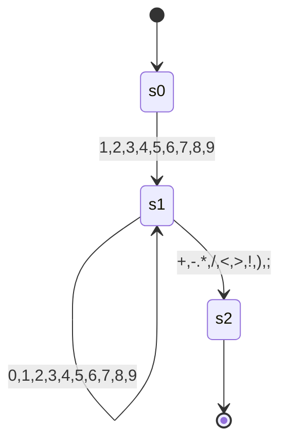
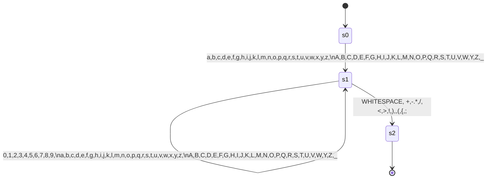

# Faul-Lang compiler

<!--toc:start-->
- [Faul-Lang compiler](#faul-lang-compiler)
  - [Aufbau](#aufbau)
    - [Vision](#vision)
    - [Token](#token)
      - [Basic](#basic)
      - [Keywords](#keywords)
      - [Operatoren](#operatoren)
  - [Parser](#parser)
    - [Regeln (Grammatik)](#regeln-grammatik)
    - [Operatorrangfolge](#operatorrangfolge)
    - [Parser Ausgabe](#parser-ausgabe)
      - [Input](#input)
      - [Parse Tree or Syntax Tree](#parse-tree-or-syntax-tree)
  - [Finite State Machines](#finite-state-machines)
    - [Integer](#integer)
    - [Word](#word)
  - [Todo](#todo)
<!--toc:end-->

Ein kleiner compiler, der faul-lang in mips assembler übersetzt.

## Aufbau
### Vision
Es soll erstmal zwei Datentypen geben, integer (int) und boolean (bool).

Damit soll möglich sein einfach Statements zu formulieren:
```
    int a = 3 + 5;
    int d = 3 * a:
    
    bool b = true;
    bool c = !b
```
Statements werden durch ein Semicolon terminiert.

Block-Statements sind auch geplant. Zunächst soll dies nur `if` beinhalten.

### Token
Tokens der Faul-Lang.
#### Basic

| Name              | Beschreibung             |
|-------------------|:-------------------------|
| EOF               | Ende des Inputs          |
| SEMICOLON         | Statements terminator    |
| V_INT             | Ganzzahl                 |
| V_BOOL            | Boolescher Wahrheitswert |
| OPEN_PARENTHESES  | {                        |
| CLOSE_PARENTHESES | }                        |
| IDENT             | Variablenname            |

#### Keywords

| Name  | Beschreibung                 |
|-------|------------------------------|
| INT   | Zum erstellen eines Integers |
| BOOL  | Zum erstellen eines Boolean  |
| IF    | Beginnt ein If-Statement     |
| ELSE  | Beginnt ein ELSE-Statement   |
| WHILE | Beginnt ein While-Statement  |

#### Operatoren

| Name          |     Beschreibung      |
|:--------------|:---------------------:|
| EQ            |           =           |
| PLUS          |           +           |
| MINUS         |           -           |
| ASTERISK      |           *           |
| SLASH         |           /           |
| OR            |  \| (Bitweises oder)  |
| AND           |  & (Bitweises  und)   |
| EQEQ          |          ==           | 
| NOTEQ         |          !=           |
| GT            |           >           |
| GTEQ          |          >=           |
| LT            |           <           |
| LTEQ          |          <=           |
| LOR           | \|\| (logischer oder) |
| LAND          |  && (logisches und)   |
| NOT           |           !           |
| OPEN_BRACKET  |           (           |
| CLOSE_BRACKET |           )           |

## Parser 

### Regeln (Grammatik)

Es wird zu bezeichnung der Regeln die Backus-Naur-Form genutzt.

Im spezielleren wird der Syntax benutzt, der hier definiert ist: [BNF Playground](https://bnfplayground.pauliankline.com/?bnf=%3Cprogram%3E%20%20%20%20%20%20%20%20%20%20%20%3A%3A%3D%20%3Cstatement%3E*%0A%3Cstatement%3E%20%20%20%20%20%20%20%20%20%3A%3A%3D%20%22int%22%20%3Cident%3E%20%22%3D%22%20%3Cexpression%3E%20%3Csemi%3E%0A%20%20%20%20%20%20%20%20%20%20%20%20%20%20%20%20%20%20%20%20%20%20%7C%20%22bool%22%20%3Cident%3E%20%22%3D%22%20%3Cexpression%3E%20%3Csemi%3E%0A%20%20%20%20%20%20%20%20%20%20%20%20%20%20%20%20%20%20%20%20%20%20%7C%20%22if%22%20%22(%22%20%3Cexpression%3E%20%22)%22%20%22%7B%22%20%3Cstatement%3E*%20%22%7D%22%0A%20%20%20%20%20%20%20%20%20%20%20%20%20%20%20%20%20%20%20%20%20%20%7C%20%3Cident%3E%20%22%3D%22%20%3Cexpression%3E%20%3Csemi%3E%0A%3Cexpression%3E%20%20%20%20%20%20%20%20%3A%3A%3D%20%3Cequality%3E%20(%20(%22%26%26%22%20%7C%20%22%7C%7C%22%20%7C%20%22%26%22%20%7C%20%22%7C%22)%20%3Cexpression%3E)%3F%0A%3Cequality%3E%20%20%20%20%20%20%20%20%20%20%3A%3A%3D%20%3Ccomparision%3E%20((%22!%3D%22%20%7C%20%22%3D%3D%22)%20%3Cequality%3E)%3F%0A%3Ccomparision%3E%20%20%20%20%20%20%20%3A%3A%3D%20%3CarithmeticExpr%3E%20(%20(%22%3E%22%20%7C%20%22%3E%3D%22%20%7C%20%22%3C%22%20%7C%20%22%3C%3D%22)%20%3Ccomparision%3E)%3F%0A%3CarithmeticExpr%3E%20%20%20%20%3A%3A%3D%20%3Cterm%3E%20((%20%22%2B%22%20%7C%20%22-%22)%20%3CarithmeticExpr%3E)%3F%0A%3Cterm%3E%20%20%20%20%20%20%20%20%20%20%20%20%20%20%3A%3A%3D%20%3Cunary%3E%20((%22*%22%20%7C%20%22%2F%22)%20%3Cterm%3E)%3F%0A%3Cunary%3E%20%20%20%20%20%20%20%20%20%20%20%20%20%3A%3A%3D%20(%22!%22%20%7C%20%22-%22)%20%3Cunary%3E%0A%20%20%20%20%20%20%20%20%20%20%20%20%20%20%20%20%20%20%20%20%20%20%7C%20%3Cprimary%3E%0A%3Cprimary%3E%20%20%20%20%20%20%20%20%20%20%20%3A%3A%3D%20%3Cvbool%3E%20%7C%20%3Cvint%3E%20%7C%20%3Cident%3E%0A%20%20%20%20%20%20%20%20%20%20%20%20%20%20%20%20%20%20%20%20%20%20%7C%20%22(%22%20%3Cexpression%3E%20%22)%22%0A%3Cvbool%3E%20%20%20%20%20%20%20%20%20%20%20%20%20%3A%3A%3D%20%22true%22%20%7C%20%22false%22%0A%3Cvint%3E%20%20%20%20%20%20%20%20%20%20%20%20%20%20%3A%3A%3D%20%5B1-9%5D%20%5B0-9%5D*%0A%20%20%20%20%20%20%20%20%20%20%20%20%20%20%20%20%20%20%20%20%20%20%7C%20%220%22%0A%3Cident%3E%20%20%20%20%20%20%20%20%20%20%20%20%20%3A%3A%3D%20(%22_%22%20%7C%20%5Ba-z%5D)%20(%22_%22%20%7C%20%5Ba-z%5D%20%7C%20%5B0-9%5D)*%0A%3Csemi%3E%20%20%20%20%20%20%20%20%20%20%20%20%20%20%3A%3A%3D%20%22%3B%22%2B&name=faul-lang).

```
<program>           ::= <statement>*
<statement>         ::= "int" <ident> "=" <expression> <semi>
                      | "bool" <ident> "=" <expression> <semi>
                      | "if" "(" <expression> ")" "{" <statement>* "}" ("else" "{" <statement>* "}")?
                      | "while" "(" <expression> ")" "{" <statement>* "}"
                      | <ident> "=" <expression> <semi>
<expression>        ::= <equality> ( ("&&" | "||" | "&" | "|") <expression>)?
<equality>          ::= <comparision> (("!=" | "==") <equality>)?
<comparision>       ::= <arithmeticExpr> ( (">" | ">=" | "<" | "<=") <comparision>)?
<arithmeticExpr>    ::= <term> (( "+" | "-") <arithmeticExpr>)?
<term>              ::= <unary> (("*" | "/") <term>)?
<unary>             ::= ("!" | "-") <unary>
                      | <primary>
<primary>           ::= <vbool> | <vint> | <ident>
                      | "(" <expression> ")"
<vbool>             ::= "true" | "false"
<vint>              ::= [1-9] [0-9]*
                      | "0"
<ident>             ::= ("_" | [a-z]) ("_" | [a-z] | [0-9])*
<semi>              ::= ";"+
```

### Operatorrangfolge

1. Klammerungen
2. `-` `!`
3. `*` `/`
4. `+` `-`
5. `>` `>=` `<` `<=`
6. `&&` `||` `|` `&`

### Parser Ausgabe

Der Parser gibt einen Parse Tree aus. Dieser lässt sich durch die toString Methode beispielsweise so ausgeben:

#### Input

```c
int a = 3 + 5;
int b = a - 6;
int c = 5 * ( 5 + 6 * 3);
bool g = 5 <= 5;
bool z = 4 >= 5*6;
if(g){
  int d = 6;
  int e = d *( 5 -3 /7);
  if(true) {
    z = 4 >= 5*6;
  }
  if((false && false) || (true || false) | 6) {

  }
}
int d = 5;
```

#### Parse Tree or Syntax Tree

```
PROGRAM
├── STATEMENT
│   ├── INT: int
│   ├── IDENT: a
│   ├── EQ: =
│   ├── EXPRESSION
│   │   └── EQUALITY
│   │       └── COMPARISON
│   │           └── ARITHMETIC_EXPR
│   │               ├── TERM
│   │               │   └── UNARY
│   │               │       └── PRIMARY
│   │               │           └── V_INT: 3
│   │               ├── PLUS: +
│   │               └── ARITHMETIC_EXPR
│   │                   └── TERM
│   │                       └── UNARY
│   │                           └── PRIMARY
│   │                               └── V_INT: 5
│   └── SEMICOLON: ;
├── STATEMENT
│   ├── BOOL: bool
│   ├── IDENT: b
│   ├── EQ: =
│   ├── EXPRESSION
│   │   └── EQUALITY
│   │       └── COMPARISON
│   │           ├── ARITHMETIC_EXPR
│   │           │   └── TERM
│   │           │       └── UNARY
│   │           │           └── PRIMARY
│   │           │               └── IDENT: a
│   │           ├── LT: <
│   │           └── COMPARISON
│   │               └── ARITHMETIC_EXPR
│   │                   └── TERM
│   │                       └── UNARY
│   │                           └── PRIMARY
│   │                               └── V_INT: 6
│   └── SEMICOLON: ;
├── STATEMENT
│   ├── INT: int
│   ├── IDENT: c
│   ├── EQ: =
│   ├── EXPRESSION
│   │   └── EQUALITY
│   │       └── COMPARISON
│   │           └── ARITHMETIC_EXPR
│   │               └── TERM
│   │                   ├── UNARY
│   │                   │   └── PRIMARY
│   │                   │       └── V_INT: 5
│   │                   ├── ASTERISK: *
│   │                   └── TERM
│   │                       └── UNARY
│   │                           └── PRIMARY
│   │                               ├── OPEN_BRACKET: (
│   │                               ├── EXPRESSION
│   │                               │   └── EQUALITY
│   │                               │       └── COMPARISON
│   │                               │           └── ARITHMETIC_EXPR
│   │                               │               ├── TERM
│   │                               │               │   └── UNARY
│   │                               │               │       └── PRIMARY
│   │                               │               │           └── V_INT: 5
│   │                               │               ├── PLUS: +
│   │                               │               └── ARITHMETIC_EXPR
│   │                               │                   └── TERM
│   │                               │                       ├── UNARY
│   │                               │                       │   └── PRIMARY
│   │                               │                       │       └── V_INT: 6
│   │                               │                       ├── ASTERISK: *
│   │                               │                       └── TERM
│   │                               │                           └── UNARY
│   │                               │                               └── PRIMARY
│   │                               │                                   └── V_INT: 3
│   │                               └── CLOSE_BRACKET: )
│   └── SEMICOLON: ;
├── STATEMENT
│   ├── BOOL: bool
│   ├── IDENT: e
│   ├── EQ: =
│   ├── EXPRESSION
│   │   ├── EQUALITY
│   │   │   └── COMPARISON
│   │   │       └── ARITHMETIC_EXPR
│   │   │           └── TERM
│   │   │               └── UNARY
│   │   │                   └── PRIMARY
│   │   │                       └── V_BOOL: true
│   │   ├── LAND: &&
│   │   └── EXPRESSION
│   │       └── EQUALITY
│   │           └── COMPARISON
│   │               └── ARITHMETIC_EXPR
│   │                   └── TERM
│   │                       └── UNARY
│   │                           └── PRIMARY
│   │                               └── V_BOOL: false
│   └── SEMICOLON: ;
├── STATEMENT
│   ├── BOOL: bool
│   ├── IDENT: g
│   ├── EQ: =
│   ├── EXPRESSION
│   │   └── EQUALITY
│   │       ├── COMPARISON
│   │       │   └── ARITHMETIC_EXPR
│   │       │       └── TERM
│   │       │           └── UNARY
│   │       │               └── PRIMARY
│   │       │                   └── V_INT: 5
│   │       ├── EQEQ: ==
│   │       └── EQUALITY
│   │           └── COMPARISON
│   │               └── ARITHMETIC_EXPR
│   │                   ├── TERM
│   │                   │   └── UNARY
│   │                   │       └── PRIMARY
│   │                   │           └── V_INT: 8
│   │                   ├── MINUS: -
│   │                   └── ARITHMETIC_EXPR
│   │                       └── TERM
│   │                           ├── UNARY
│   │                           │   └── PRIMARY
│   │                           │       └── V_INT: 5
│   │                           ├── ASTERISK: *
│   │                           └── TERM
│   │                               └── UNARY
│   │                                   └── PRIMARY
│   │                                       └── V_INT: 3
│   └── SEMICOLON: ;
├── STATEMENT
│   ├── BOOL: bool
│   ├── IDENT: z
│   ├── EQ: =
│   ├── EXPRESSION
│   │   └── EQUALITY
│   │       └── COMPARISON
│   │           ├── ARITHMETIC_EXPR
│   │           │   └── TERM
│   │           │       └── UNARY
│   │           │           └── PRIMARY
│   │           │               └── V_INT: 4
│   │           ├── GTEQ: >=
│   │           └── COMPARISON
│   │               └── ARITHMETIC_EXPR
│   │                   └── TERM
│   │                       ├── UNARY
│   │                       │   └── PRIMARY
│   │                       │       └── V_INT: 5
│   │                       ├── ASTERISK: *
│   │                       └── TERM
│   │                           └── UNARY
│   │                               └── PRIMARY
│   │                                   └── V_INT: 6
│   └── SEMICOLON: ;
├── STATEMENT
│   ├── IF: if
│   ├── OPEN_BRACKET: (
│   ├── EXPRESSION
│   │   ├── EQUALITY
│   │   │   └── COMPARISON
│   │   │       └── ARITHMETIC_EXPR
│   │   │           └── TERM
│   │   │               └── UNARY
│   │   │                   └── PRIMARY
│   │   │                       └── IDENT: g
│   │   ├── LAND: &&
│   │   └── EXPRESSION
│   │       └── EQUALITY
│   │           └── COMPARISON
│   │               └── ARITHMETIC_EXPR
│   │                   └── TERM
│   │                       └── UNARY
│   │                           └── PRIMARY
│   │                               └── V_BOOL: true
│   ├── CLOSE_BRACKET: )
│   ├── OPEN_PARANTHESES: {
│   ├── STATEMENT
│   │   ├── INT: int
│   │   ├── IDENT: d
│   │   ├── EQ: =
│   │   ├── EXPRESSION
│   │   │   └── EQUALITY
│   │   │       └── COMPARISON
│   │   │           └── ARITHMETIC_EXPR
│   │   │               └── TERM
│   │   │                   └── UNARY
│   │   │                       └── PRIMARY
│   │   │                           └── V_INT: 6
│   │   └── SEMICOLON: ;
│   ├── STATEMENT
│   │   ├── IF: if
│   │   ├── OPEN_BRACKET: (
│   │   ├── EXPRESSION
│   │   │   └── EQUALITY
│   │   │       └── COMPARISON
│   │   │           └── ARITHMETIC_EXPR
│   │   │               └── TERM
│   │   │                   └── UNARY
│   │   │                       └── PRIMARY
│   │   │                           └── V_BOOL: true
│   │   ├── CLOSE_BRACKET: )
│   │   ├── OPEN_PARANTHESES: {
│   │   ├── STATEMENT
│   │   │   ├── IDENT: z
│   │   │   ├── EQ: =
│   │   │   ├── EXPRESSION
│   │   │   │   └── EQUALITY
│   │   │   │       └── COMPARISON
│   │   │   │           ├── ARITHMETIC_EXPR
│   │   │   │           │   └── TERM
│   │   │   │           │       └── UNARY
│   │   │   │           │           └── PRIMARY
│   │   │   │           │               └── V_INT: 4
│   │   │   │           ├── GTEQ: >=
│   │   │   │           └── COMPARISON
│   │   │   │               └── ARITHMETIC_EXPR
│   │   │   │                   └── TERM
│   │   │   │                       ├── UNARY
│   │   │   │                       │   └── PRIMARY
│   │   │   │                       │       └── V_INT: 5
│   │   │   │                       ├── ASTERISK: *
│   │   │   │                       └── TERM
│   │   │   │                           └── UNARY
│   │   │   │                               └── PRIMARY
│   │   │   │                                   └── V_INT: 6
│   │   │   └── SEMICOLON: ;
│   │   ├── STATEMENT
│   │   │   ├── INT: int
│   │   │   ├── IDENT: asd
│   │   │   ├── EQ: =
│   │   │   ├── EXPRESSION
│   │   │   │   └── EQUALITY
│   │   │   │       └── COMPARISON
│   │   │   │           └── ARITHMETIC_EXPR
│   │   │   │               └── TERM
│   │   │   │                   └── UNARY
│   │   │   │                       └── PRIMARY
│   │   │   │                           └── V_INT: 5
│   │   │   └── SEMICOLON: ;
│   │   ├── CLOSE_PARANTHESES: }
│   │   ├── ELSE: else
│   │   ├── OPEN_PARANTHESES: {
│   │   ├── STATEMENT
│   │   │   ├── INT: int
│   │   │   ├── IDENT: paul
│   │   │   ├── EQ: =
│   │   │   ├── EXPRESSION
│   │   │   │   └── EQUALITY
│   │   │   │       └── COMPARISON
│   │   │   │           └── ARITHMETIC_EXPR
│   │   │   │               └── TERM
│   │   │   │                   └── UNARY
│   │   │   │                       └── PRIMARY
│   │   │   │                           └── V_INT: 0
│   │   │   └── SEMICOLON: ;
│   │   ├── STATEMENT
│   │   │   ├── WHILE: while
│   │   │   ├── OPEN_BRACKET: (
│   │   │   ├── EXPRESSION
│   │   │   │   └── EQUALITY
│   │   │   │       └── COMPARISON
│   │   │   │           └── ARITHMETIC_EXPR
│   │   │   │               └── TERM
│   │   │   │                   └── UNARY
│   │   │   │                       └── PRIMARY
│   │   │   │                           └── V_BOOL: true
│   │   │   ├── CLOSE_BRACKET: )
│   │   │   ├── OPEN_PARANTHESES: {
│   │   │   ├── STATEMENT
│   │   │   │   ├── INT: int
│   │   │   │   ├── IDENT: fabian
│   │   │   │   ├── EQ: =
│   │   │   │   ├── EXPRESSION
│   │   │   │   │   └── EQUALITY
│   │   │   │   │       └── COMPARISON
│   │   │   │   │           └── ARITHMETIC_EXPR
│   │   │   │   │               └── TERM
│   │   │   │   │                   └── UNARY
│   │   │   │   │                       └── PRIMARY
│   │   │   │   │                           └── V_INT: 0
│   │   │   │   └── SEMICOLON: ;
│   │   │   └── CLOSE_PARANTHESES: }
│   │   └── CLOSE_PARANTHESES: }
│   ├── STATEMENT
│   │   ├── IF: if
│   │   ├── OPEN_BRACKET: (
│   │   ├── EXPRESSION
│   │   │   ├── EQUALITY
│   │   │   │   └── COMPARISON
│   │   │   │       └── ARITHMETIC_EXPR
│   │   │   │           └── TERM
│   │   │   │               └── UNARY
│   │   │   │                   └── PRIMARY
│   │   │   │                       ├── OPEN_BRACKET: (
│   │   │   │                       ├── EXPRESSION
│   │   │   │                       │   ├── EQUALITY
│   │   │   │                       │   │   └── COMPARISON
│   │   │   │                       │   │       └── ARITHMETIC_EXPR
│   │   │   │                       │   │           └── TERM
│   │   │   │                       │   │               └── UNARY
│   │   │   │                       │   │                   └── PRIMARY
│   │   │   │                       │   │                       └── V_BOOL: false
│   │   │   │                       │   ├── LAND: &&
│   │   │   │                       │   └── EXPRESSION
│   │   │   │                       │       └── EQUALITY
│   │   │   │                       │           └── COMPARISON
│   │   │   │                       │               └── ARITHMETIC_EXPR
│   │   │   │                       │                   └── TERM
│   │   │   │                       │                       └── UNARY
│   │   │   │                       │                           └── PRIMARY
│   │   │   │                       │                               └── V_BOOL: false
│   │   │   │                       └── CLOSE_BRACKET: )
│   │   │   ├── LOR: ||
│   │   │   └── EXPRESSION
│   │   │       ├── EQUALITY
│   │   │       │   └── COMPARISON
│   │   │       │       └── ARITHMETIC_EXPR
│   │   │       │           └── TERM
│   │   │       │               └── UNARY
│   │   │       │                   └── PRIMARY
│   │   │       │                       ├── OPEN_BRACKET: (
│   │   │       │                       ├── EXPRESSION
│   │   │       │                       │   ├── EQUALITY
│   │   │       │                       │   │   └── COMPARISON
│   │   │       │                       │   │       └── ARITHMETIC_EXPR
│   │   │       │                       │   │           └── TERM
│   │   │       │                       │   │               └── UNARY
│   │   │       │                       │   │                   └── PRIMARY
│   │   │       │                       │   │                       └── V_BOOL: true
│   │   │       │                       │   ├── LOR: ||
│   │   │       │                       │   └── EXPRESSION
│   │   │       │                       │       └── EQUALITY
│   │   │       │                       │           └── COMPARISON
│   │   │       │                       │               └── ARITHMETIC_EXPR
│   │   │       │                       │                   └── TERM
│   │   │       │                       │                       └── UNARY
│   │   │       │                       │                           └── PRIMARY
│   │   │       │                       │                               └── V_BOOL: false
│   │   │       │                       └── CLOSE_BRACKET: )
│   │   │       ├── OR: |
│   │   │       └── EXPRESSION
│   │   │           └── EQUALITY
│   │   │               └── COMPARISON
│   │   │                   └── ARITHMETIC_EXPR
│   │   │                       └── TERM
│   │   │                           └── UNARY
│   │   │                               └── PRIMARY
│   │   │                                   └── V_INT: 6
│   │   ├── CLOSE_BRACKET: )
│   │   ├── OPEN_PARANTHESES: {
│   │   ├── STATEMENT
│   │   │   ├── INT: int
│   │   │   ├── IDENT: asd
│   │   │   ├── EQ: =
│   │   │   ├── EXPRESSION
│   │   │   │   └── EQUALITY
│   │   │   │       └── COMPARISON
│   │   │   │           └── ARITHMETIC_EXPR
│   │   │   │               └── TERM
│   │   │   │                   └── UNARY
│   │   │   │                       └── PRIMARY
│   │   │   │                           └── V_INT: 5
│   │   │   └── SEMICOLON: ;
│   │   └── CLOSE_PARANTHESES: }
│   └── CLOSE_PARANTHESES: }
└── STATEMENT
    ├── INT: int
    ├── IDENT: d
    ├── EQ: =
    ├── EXPRESSION
    │   └── EQUALITY
    │       └── COMPARISON
    │           └── ARITHMETIC_EXPR
    │               └── TERM
    │                   └── UNARY
    │                       └── PRIMARY
    │                           └── V_INT: 5
    └── SEMICOLON: ;

```
### Abstact Syntax Tree

```
PROGRAM
├── DECLARATION
│   ├── IDENT: a
│   └── ADRESS: 0
├── ASSIGNMENT
│   ├── IDENT: a
│   └── PLUS
│       ├── INTEGER: 3
│       └── INTEGER: 5
├── DECLARATION
│   ├── IDENT: b
│   └── ADRESS: 1
├── ASSIGNMENT
│   ├── IDENT: b
│   └── LT
│       ├── IDENT: a
│       └── INTEGER: 6
├── DECLARATION
│   ├── IDENT: c
│   └── ADRESS: 2
├── ASSIGNMENT
│   ├── IDENT: c
│   └── ASTERISK
│       ├── INTEGER: 5
│       └── PLUS
│           ├── INTEGER: 5
│           └── ASTERISK
│               ├── INTEGER: 6
│               └── INTEGER: 3
├── DECLARATION
│   ├── IDENT: e
│   └── ADRESS: 3
├── ASSIGNMENT
│   ├── IDENT: e
│   └── LAND
│       ├── BOOLEAN: true
│       └── BOOLEAN: false
├── DECLARATION
│   ├── IDENT: g
│   └── ADRESS: 4
├── ASSIGNMENT
│   ├── IDENT: g
│   └── EQEQ
│       ├── INTEGER: 5
│       └── MINUS
│           ├── INTEGER: 8
│           └── ASTERISK
│               ├── INTEGER: 5
│               └── INTEGER: 3
├── DECLARATION
│   ├── IDENT: z
│   └── ADRESS: 5
├── ASSIGNMENT
│   ├── IDENT: z
│   └── GTEQ
│       ├── INTEGER: 4
│       └── ASTERISK
│           ├── INTEGER: 5
│           └── INTEGER: 6
├── IF
│   ├── CONDITION
│   │   └── LAND
│   │       ├── IDENT: g
│   │       └── BOOLEAN: true
│   └── BRANCH
│       ├── DECLARATION
│       │   ├── IDENT: d
│       │   └── ADRESS: 6
│       ├── ASSIGNMENT
│       │   ├── IDENT: d
│       │   └── INTEGER: 6
│       ├── IF
│       │   ├── CONDITION
│       │   │   └── BOOLEAN: true
│       │   ├── BRANCH
│       │   │   ├── ASSIGNMENT
│       │   │   │   ├── IDENT: z
│       │   │   │   └── GTEQ
│       │   │   │       ├── INTEGER: 4
│       │   │   │       └── ASTERISK
│       │   │   │           ├── INTEGER: 5
│       │   │   │           └── INTEGER: 6
│       │   │   ├── DECLARATION
│       │   │   │   ├── IDENT: asd
│       │   │   │   └── ADRESS: 7
│       │   │   └── ASSIGNMENT
│       │   │       ├── IDENT: asd
│       │   │       └── INTEGER: 5
│       │   └── BRANCH
│       │       ├── DECLARATION
│       │       │   ├── IDENT: paul
│       │       │   └── ADRESS: 7
│       │       ├── ASSIGNMENT
│       │       │   ├── IDENT: paul
│       │       │   └── INTEGER: 0
│       │       └── WHILE
│       │           ├── CONDITION
│       │           │   └── BOOLEAN: true
│       │           └── BRANCH
│       │               ├── DECLARATION
│       │               │   ├── IDENT: fabian
│       │               │   └── ADRESS: 8
│       │               └── ASSIGNMENT
│       │                   ├── IDENT: fabian
│       │                   └── INTEGER: 0
│       └── IF
│           ├── CONDITION
│           │   └── LOR
│           │       ├── LAND
│           │       │   ├── BOOLEAN: false
│           │       │   └── BOOLEAN: false
│           │       └── OR
│           │           ├── LOR
│           │           │   ├── BOOLEAN: true
│           │           │   └── BOOLEAN: false
│           │           └── INTEGER: 6
│           └── BRANCH
│               ├── DECLARATION
│               │   ├── IDENT: asd
│               │   └── ADRESS: 7
│               └── ASSIGNMENT
│                   ├── IDENT: asd
│                   └── INTEGER: 5
├── DECLARATION
│   ├── IDENT: d
│   └── ADRESS: 6
└── ASSIGNMENT
    ├── IDENT: d
    └── INTEGER: 5
```

## Finite State Machines

### Integer


### Word



## Todo
- [X] Lexer
- [x] Parser
- [x] Abstract Syntax Tree (AST)
- [ ] Semantische Analyse
  - Typechecking
  - Optimierung
- [ ] Code generation
