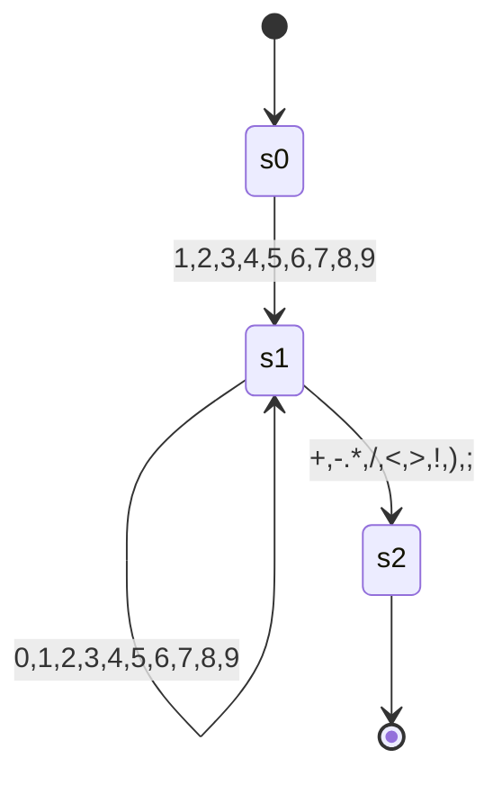
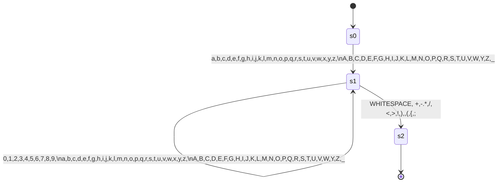

# Faul-Lang compiler

<!--toc:start-->
- [Faul-Lang compiler](#faul-lang-compiler)
  - [Aufbau](#aufbau)
    - [Vision](#vision)
  - [Sprache](#sprache)
    - [Regeln (Grammatik)](#regeln-grammatik)
    - [Operatorrangfolge](#operatorrangfolge)
    - [Token](#token)
      - [Basic](#basic)
      - [Keywords](#keywords)
      - [Operatoren](#operatoren)
  - [Compiler Phasen](#compiler-phasen)
    - [Frontend](#frontend)
      - [Input](#input)
      - [Lexer](#lexer)
      - [Parser](#parser)
      - [Semantische Analyse](#semantische-analyse)
  - [Finite State Machines](#finite-state-machines)
    - [Integer](#integer)
    - [Word](#word)
  - [Todo](#todo)
<!--toc:end-->

Ein kleiner compiler, der faul-lang in mips assembler übersetzt.

## Aufbau
### Vision
Es soll erstmal zwei Datentypen geben, integer (int) und boolean (bool).

Damit soll möglich sein einfach Statements zu formulieren:
```
    int a = 3 + 5;
    int d = 3 * a:
    
    bool b = true;
    bool c = !b
```
Statements werden durch ein Semicolon terminiert.

Block-Statements sind auch geplant. Zunächst soll dies nur `if` beinhalten.


## Sprache

### Regeln (Grammatik)

Es wird zu bezeichnung der Regeln die Backus-Naur-Form genutzt.

Im spezielleren wird der Syntax benutzt, der hier definiert ist: [BNF Playground](https://bnfplayground.pauliankline.com/?bnf=%3Cprogram%3E%20%20%20%20%20%20%20%20%20%20%20%3A%3A%3D%20%3Cstatement%3E*%0A%3Cstatement%3E%20%20%20%20%20%20%20%20%20%3A%3A%3D%20%22int%22%20%3Cident%3E%20%22%3D%22%20%3Cexpression%3E%20%3Csemi%3E%0A%20%20%20%20%20%20%20%20%20%20%20%20%20%20%20%20%20%20%20%20%20%20%7C%20%22bool%22%20%3Cident%3E%20%22%3D%22%20%3Cexpression%3E%20%3Csemi%3E%0A%20%20%20%20%20%20%20%20%20%20%20%20%20%20%20%20%20%20%20%20%20%20%7C%20%22if%22%20%22(%22%20%3Cexpression%3E%20%22)%22%20%22%7B%22%20%3Cstatement%3E*%20%22%7D%22%20(%22else%22%20%22%7B%22%20%3Cstatement%3E*%20%22%7D%22)%3F%0A%20%20%20%20%20%20%20%20%20%20%20%20%20%20%20%20%20%20%20%20%20%20%7C%20%22while%22%20%22(%22%20%3Cexpression%3E%20%22)%22%20%22%7B%22%20%3Cstatement%3E*%20%22%7D%22%0A%20%20%20%20%20%20%20%20%20%20%20%20%20%20%20%20%20%20%20%20%20%20%7C%20%3Cident%3E%20%22%3D%22%20%3Cexpression%3E%20%3Csemi%3E%0A%3Cexpression%3E%20%20%20%20%20%20%20%20%3A%3A%3D%20%3Cequality%3E%20(%20(%22%26%26%22%20%7C%20%22%7C%7C%22%20%7C%20%22%26%22%20%7C%20%22%7C%22)%20%3Cexpression%3E)%3F%0A%3Cequality%3E%20%20%20%20%20%20%20%20%20%20%3A%3A%3D%20%3Ccomparision%3E%20((%22!%3D%22%20%7C%20%22%3D%3D%22)%20%3Cequality%3E)%3F%0A%3Ccomparision%3E%20%20%20%20%20%20%20%3A%3A%3D%20%3CarithmeticExpr%3E%20(%20(%22%3E%22%20%7C%20%22%3E%3D%22%20%7C%20%22%3C%22%20%7C%20%22%3C%3D%22)%20%3Ccomparision%3E)%3F%0A%3CarithmeticExpr%3E%20%20%20%20%3A%3A%3D%20%3Cterm%3E%20((%20%22%2B%22%20%7C%20%22-%22)%20%3CarithmeticExpr%3E)%3F%0A%3Cterm%3E%20%20%20%20%20%20%20%20%20%20%20%20%20%20%3A%3A%3D%20%3Cunary%3E%20((%22*%22%20%7C%20%22%2F%22%20%7C%20%22%25%22)%20%3Cterm%3E)%3F%0A%3Cunary%3E%20%20%20%20%20%20%20%20%20%20%20%20%20%3A%3A%3D%20(%22!%22%20%7C%20%22-%22)%20%3Cunary%3E%0A%20%20%20%20%20%20%20%20%20%20%20%20%20%20%20%20%20%20%20%20%20%20%7C%20%3Cprimary%3E%0A%3Cprimary%3E%20%20%20%20%20%20%20%20%20%20%20%3A%3A%3D%20%3Cvbool%3E%20%7C%20%3Cvint%3E%20%7C%20%3Cident%3E%0A%20%20%20%20%20%20%20%20%20%20%20%20%20%20%20%20%20%20%20%20%20%20%7C%20%22(%22%20%3Cexpression%3E%20%22)%22%0A%3Cvbool%3E%20%20%20%20%20%20%20%20%20%20%20%20%20%3A%3A%3D%20%22true%22%20%7C%20%22false%22%0A%3Cvint%3E%20%20%20%20%20%20%20%20%20%20%20%20%20%20%3A%3A%3D%20%5B1-9%5D%20%5B0-9%5D*%0A%20%20%20%20%20%20%20%20%20%20%20%20%20%20%20%20%20%20%20%20%20%20%7C%20%220%22%0A%3Cident%3E%20%20%20%20%20%20%20%20%20%20%20%20%20%3A%3A%3D%20(%22_%22%20%7C%20%5Ba-z%5D)%20(%22_%22%20%7C%20%5Ba-z%5D%20%7C%20%5B0-9%5D)*%0A%3Csemi%3E%20%20%20%20%20%20%20%20%20%20%20%20%20%20%3A%3A%3D%20%22%3B%22%2B&name=faul-lang).

```
<program>           ::= <statement>*
<statement>         ::= "int" <ident> "=" <expression> <semi>
                      | "bool" <ident> "=" <expression> <semi>
                      | "if" "(" <expression> ")" "{" <statement>* "}" ("else" "{" <statement>* "}")?
                      | "while" "(" <expression> ")" "{" <statement>* "}"
                      | <ident> "=" <expression> <semi>
<expression>        ::= <equality> ( ("&&" | "||" | "&" | "|") <expression>)?
<equality>          ::= <comparision> (("!=" | "==") <equality>)?
<comparision>       ::= <arithmeticExpr> ( (">" | ">=" | "<" | "<=") <comparision>)?
<arithmeticExpr>    ::= <term> (( "+" | "-") <arithmeticExpr>)?
<term>              ::= <unary> (("*" | "/" | "%") <term>)?
<unary>             ::= ("!" | "-") <unary>
                      | <primary>
<primary>           ::= <vbool> | <vint> | <ident>
                      | "(" <expression> ")"
<vbool>             ::= "true" | "false"
<vint>              ::= [1-9] [0-9]*
                      | "0"
<ident>             ::= ("_" | [a-z]) ("_" | [a-z] | [0-9])* (<function_call)?
<function_call>     ::= "(" (<expression> ("," <expression>)*)? ")"
<semi>              ::= ";"+
```

### Operatorrangfolge

1. Klammerungen
2. `-` `!`
3. `*` `/`
4. `+` `-`
5. `>` `>=` `<` `<=`
6. `&&` `||` `|` `&`

### Token 
Tokens der Faul-Lang.
#### Basic

| Name              | Beschreibung             |
|-------------------|:-------------------------|
| EOF               | Ende des Inputs          |
| SEMICOLON         | Statements terminator    |
| V_INT             | Ganzzahl                 |
| V_BOOL            | Boolescher Wahrheitswert |
| OPEN_PARENTHESES  | {                        |
| CLOSE_PARENTHESES | }                        |
| IDENT             | Variablenname            |

#### Keywords

| Name  | Beschreibung                 |
|-------|------------------------------|
| INT   | Zum erstellen eines Integers |
| BOOL  | Zum erstellen eines Boolean  |
| IF    | Beginnt ein If-Statement     |
| ELSE  | Beginnt ein ELSE-Statement   |
| WHILE | Beginnt ein While-Statement  |

#### Operatoren

| Name          |     Beschreibung      |
|:--------------|:---------------------:|
| EQ            |           =           |
| PLUS          |           +           |
| MINUS         |           -           |
| ASTERISK      |           *           |
| SLASH         |           /           |
| OR            |  \| (Bitweises oder)  |
| AND           |  & (Bitweises  und)   |
| EQEQ          |          ==           | 
| NOTEQ         |          !=           |
| GT            |           >           |
| GTEQ          |          >=           |
| LT            |           <           |
| LTEQ          |          <=           |
| LOR           | \|\| (logischer oder) |
| LAND          |  && (logisches und)   |
| NOT           |           !           |
| OPEN_BRACKET  |           (           |
| CLOSE_BRACKET |           )           |


## Compiler Phasen

### Frontend

#### Input

```c
int a = -3 + 5;
bool b = !true;
int c = 5 * ( 5 + 6 * 3);
bool e = true && false;
bool g = 5 == 8 - 5*3;
bool z = 4 >= 5*6;
if(g && true){
    int d = 6;
    if(true) {
        z = 4 >= 5*6;
        int asd = 5;
    }
    else {
        int paul = 0;
        while(true){
            int fabian = 0;
        }
    }
    if((false && false) || (true || false)) {
        int asd = 0;
    }
}
int d = 5 % 3;
int and = 5 & 5;
int z1 = !(3-4);
```

#### Lexer
Der Lexer geneiert aus dem [Input](#input) ein stream an [Token](#token)

#### Parser

Der Parser verarbeitet den [Token-Stream](#token) und gibt einen Parse Tree aus. Hierbei wird auch auf Syntaxfehler hin überprüft.

Dieser lässt sich durch die toString Methode beispielsweise so ausgeben:

```
Parse Tree (Syntax Tree)

PROGRAM
├── STATEMENT
│   ├── INT: int
│   ├── IDENT: a
│   ├── EQ: =
│   ├── EXPRESSION
│   │   └── EQUALITY
│   │       └── COMPARISON
│   │           └── ARITHMETIC_EXPR
│   │               ├── TERM
│   │               │   └── UNARY
│   │               │       ├── MINUS: -
│   │               │       └── UNARY
│   │               │           └── PRIMARY
│   │               │               └── V_INT: 3
│   │               ├── PLUS: +
│   │               └── ARITHMETIC_EXPR
│   │                   └── TERM
│   │                       └── UNARY
│   │                           └── PRIMARY
│   │                               └── V_INT: 5
│   └── SEMICOLON: ;
├── STATEMENT
│   ├── BOOL: bool
│   ├── IDENT: b
│   ├── EQ: =
│   ├── EXPRESSION
│   │   └── EQUALITY
│   │       └── COMPARISON
│   │           └── ARITHMETIC_EXPR
│   │               └── TERM
│   │                   └── UNARY
│   │                       ├── NOT: !
│   │                       └── UNARY
│   │                           └── PRIMARY
│   │                               └── V_BOOL: true
│   └── SEMICOLON: ;
├── STATEMENT
│   ├── INT: int
│   ├── IDENT: c
│   ├── EQ: =
│   ├── EXPRESSION
│   │   └── EQUALITY
│   │       └── COMPARISON
│   │           └── ARITHMETIC_EXPR
│   │               └── TERM
│   │                   ├── UNARY
│   │                   │   └── PRIMARY
│   │                   │       └── V_INT: 5
│   │                   ├── ASTERISK: *
│   │                   └── TERM
│   │                       └── UNARY
│   │                           └── PRIMARY
│   │                               ├── OPEN_BRACKET: (
│   │                               ├── EXPRESSION
│   │                               │   └── EQUALITY
│   │                               │       └── COMPARISON
│   │                               │           └── ARITHMETIC_EXPR
│   │                               │               ├── TERM
│   │                               │               │   └── UNARY
│   │                               │               │       └── PRIMARY
│   │                               │               │           └── V_INT: 5
│   │                               │               ├── PLUS: +
│   │                               │               └── ARITHMETIC_EXPR
│   │                               │                   └── TERM
│   │                               │                       ├── UNARY
│   │                               │                       │   └── PRIMARY
│   │                               │                       │       └── V_INT: 6
│   │                               │                       ├── ASTERISK: *
│   │                               │                       └── TERM
│   │                               │                           └── UNARY
│   │                               │                               └── PRIMARY
│   │                               │                                   └── V_INT: 3
│   │                               └── CLOSE_BRACKET: )
│   └── SEMICOLON: ;
├── STATEMENT
│   ├── BOOL: bool
│   ├── IDENT: e
│   ├── EQ: =
│   ├── EXPRESSION
│   │   ├── EQUALITY
│   │   │   └── COMPARISON
│   │   │       └── ARITHMETIC_EXPR
│   │   │           └── TERM
│   │   │               └── UNARY
│   │   │                   └── PRIMARY
│   │   │                       └── V_BOOL: true
│   │   ├── LAND: &&
│   │   └── EXPRESSION
│   │       └── EQUALITY
│   │           └── COMPARISON
│   │               └── ARITHMETIC_EXPR
│   │                   └── TERM
│   │                       └── UNARY
│   │                           └── PRIMARY
│   │                               └── V_BOOL: false
│   └── SEMICOLON: ;
├── STATEMENT
│   ├── BOOL: bool
│   ├── IDENT: g
│   ├── EQ: =
│   ├── EXPRESSION
│   │   └── EQUALITY
│   │       ├── COMPARISON
│   │       │   └── ARITHMETIC_EXPR
│   │       │       └── TERM
│   │       │           └── UNARY
│   │       │               └── PRIMARY
│   │       │                   └── V_INT: 5
│   │       ├── EQEQ: ==
│   │       └── EQUALITY
│   │           └── COMPARISON
│   │               └── ARITHMETIC_EXPR
│   │                   ├── TERM
│   │                   │   └── UNARY
│   │                   │       └── PRIMARY
│   │                   │           └── V_INT: 8
│   │                   ├── MINUS: -
│   │                   └── ARITHMETIC_EXPR
│   │                       └── TERM
│   │                           ├── UNARY
│   │                           │   └── PRIMARY
│   │                           │       └── V_INT: 5
│   │                           ├── ASTERISK: *
│   │                           └── TERM
│   │                               └── UNARY
│   │                                   └── PRIMARY
│   │                                       └── V_INT: 3
│   └── SEMICOLON: ;
├── STATEMENT
│   ├── BOOL: bool
│   ├── IDENT: z
│   ├── EQ: =
│   ├── EXPRESSION
│   │   └── EQUALITY
│   │       └── COMPARISON
│   │           ├── ARITHMETIC_EXPR
│   │           │   └── TERM
│   │           │       └── UNARY
│   │           │           └── PRIMARY
│   │           │               └── V_INT: 4
│   │           ├── GTEQ: >=
│   │           └── COMPARISON
│   │               └── ARITHMETIC_EXPR
│   │                   └── TERM
│   │                       ├── UNARY
│   │                       │   └── PRIMARY
│   │                       │       └── V_INT: 5
│   │                       ├── ASTERISK: *
│   │                       └── TERM
│   │                           └── UNARY
│   │                               └── PRIMARY
│   │                                   └── V_INT: 6
│   └── SEMICOLON: ;
├── STATEMENT
│   ├── IF: if
│   ├── OPEN_BRACKET: (
│   ├── EXPRESSION
│   │   ├── EQUALITY
│   │   │   └── COMPARISON
│   │   │       └── ARITHMETIC_EXPR
│   │   │           └── TERM
│   │   │               └── UNARY
│   │   │                   └── PRIMARY
│   │   │                       └── IDENT: g
│   │   ├── LAND: &&
│   │   └── EXPRESSION
│   │       └── EQUALITY
│   │           └── COMPARISON
│   │               └── ARITHMETIC_EXPR
│   │                   └── TERM
│   │                       └── UNARY
│   │                           └── PRIMARY
│   │                               └── V_BOOL: true
│   ├── CLOSE_BRACKET: )
│   ├── OPEN_PARANTHESES: {
│   ├── STATEMENT
│   │   ├── INT: int
│   │   ├── IDENT: d
│   │   ├── EQ: =
│   │   ├── EXPRESSION
│   │   │   └── EQUALITY
│   │   │       └── COMPARISON
│   │   │           └── ARITHMETIC_EXPR
│   │   │               └── TERM
│   │   │                   └── UNARY
│   │   │                       └── PRIMARY
│   │   │                           └── V_INT: 6
│   │   └── SEMICOLON: ;
│   ├── STATEMENT
│   │   ├── IF: if
│   │   ├── OPEN_BRACKET: (
│   │   ├── EXPRESSION
│   │   │   └── EQUALITY
│   │   │       └── COMPARISON
│   │   │           └── ARITHMETIC_EXPR
│   │   │               └── TERM
│   │   │                   └── UNARY
│   │   │                       └── PRIMARY
│   │   │                           └── V_BOOL: true
│   │   ├── CLOSE_BRACKET: )
│   │   ├── OPEN_PARANTHESES: {
│   │   ├── STATEMENT
│   │   │   ├── IDENT: z
│   │   │   ├── EQ: =
│   │   │   ├── EXPRESSION
│   │   │   │   └── EQUALITY
│   │   │   │       └── COMPARISON
│   │   │   │           ├── ARITHMETIC_EXPR
│   │   │   │           │   └── TERM
│   │   │   │           │       └── UNARY
│   │   │   │           │           └── PRIMARY
│   │   │   │           │               └── V_INT: 4
│   │   │   │           ├── GTEQ: >=
│   │   │   │           └── COMPARISON
│   │   │   │               └── ARITHMETIC_EXPR
│   │   │   │                   └── TERM
│   │   │   │                       ├── UNARY
│   │   │   │                       │   └── PRIMARY
│   │   │   │                       │       └── V_INT: 5
│   │   │   │                       ├── ASTERISK: *
│   │   │   │                       └── TERM
│   │   │   │                           └── UNARY
│   │   │   │                               └── PRIMARY
│   │   │   │                                   └── V_INT: 6
│   │   │   └── SEMICOLON: ;
│   │   ├── STATEMENT
│   │   │   ├── INT: int
│   │   │   ├── IDENT: asd
│   │   │   ├── EQ: =
│   │   │   ├── EXPRESSION
│   │   │   │   └── EQUALITY
│   │   │   │       └── COMPARISON
│   │   │   │           └── ARITHMETIC_EXPR
│   │   │   │               └── TERM
│   │   │   │                   └── UNARY
│   │   │   │                       └── PRIMARY
│   │   │   │                           └── V_INT: 5
│   │   │   └── SEMICOLON: ;
│   │   ├── CLOSE_PARANTHESES: }
│   │   ├── ELSE: else
│   │   ├── OPEN_PARANTHESES: {
│   │   ├── STATEMENT
│   │   │   ├── INT: int
│   │   │   ├── IDENT: paul
│   │   │   ├── EQ: =
│   │   │   ├── EXPRESSION
│   │   │   │   └── EQUALITY
│   │   │   │       └── COMPARISON
│   │   │   │           └── ARITHMETIC_EXPR
│   │   │   │               └── TERM
│   │   │   │                   └── UNARY
│   │   │   │                       └── PRIMARY
│   │   │   │                           └── V_INT: 0
│   │   │   └── SEMICOLON: ;
│   │   ├── STATEMENT
│   │   │   ├── WHILE: while
│   │   │   ├── OPEN_BRACKET: (
│   │   │   ├── EXPRESSION
│   │   │   │   └── EQUALITY
│   │   │   │       └── COMPARISON
│   │   │   │           └── ARITHMETIC_EXPR
│   │   │   │               └── TERM
│   │   │   │                   └── UNARY
│   │   │   │                       └── PRIMARY
│   │   │   │                           └── V_BOOL: true
│   │   │   ├── CLOSE_BRACKET: )
│   │   │   ├── OPEN_PARANTHESES: {
│   │   │   ├── STATEMENT
│   │   │   │   ├── INT: int
│   │   │   │   ├── IDENT: fabian
│   │   │   │   ├── EQ: =
│   │   │   │   ├── EXPRESSION
│   │   │   │   │   └── EQUALITY
│   │   │   │   │       └── COMPARISON
│   │   │   │   │           └── ARITHMETIC_EXPR
│   │   │   │   │               └── TERM
│   │   │   │   │                   └── UNARY
│   │   │   │   │                       └── PRIMARY
│   │   │   │   │                           └── V_INT: 0
│   │   │   │   └── SEMICOLON: ;
│   │   │   └── CLOSE_PARANTHESES: }
│   │   └── CLOSE_PARANTHESES: }
│   ├── STATEMENT
│   │   ├── IF: if
│   │   ├── OPEN_BRACKET: (
│   │   ├── EXPRESSION
│   │   │   ├── EQUALITY
│   │   │   │   └── COMPARISON
│   │   │   │       └── ARITHMETIC_EXPR
│   │   │   │           └── TERM
│   │   │   │               └── UNARY
│   │   │   │                   └── PRIMARY
│   │   │   │                       ├── OPEN_BRACKET: (
│   │   │   │                       ├── EXPRESSION
│   │   │   │                       │   ├── EQUALITY
│   │   │   │                       │   │   └── COMPARISON
│   │   │   │                       │   │       └── ARITHMETIC_EXPR
│   │   │   │                       │   │           └── TERM
│   │   │   │                       │   │               └── UNARY
│   │   │   │                       │   │                   └── PRIMARY
│   │   │   │                       │   │                       └── V_BOOL: false
│   │   │   │                       │   ├── LAND: &&
│   │   │   │                       │   └── EXPRESSION
│   │   │   │                       │       └── EQUALITY
│   │   │   │                       │           └── COMPARISON
│   │   │   │                       │               └── ARITHMETIC_EXPR
│   │   │   │                       │                   └── TERM
│   │   │   │                       │                       └── UNARY
│   │   │   │                       │                           └── PRIMARY
│   │   │   │                       │                               └── V_BOOL: false
│   │   │   │                       └── CLOSE_BRACKET: )
│   │   │   ├── LOR: ||
│   │   │   └── EXPRESSION
│   │   │       └── EQUALITY
│   │   │           └── COMPARISON
│   │   │               └── ARITHMETIC_EXPR
│   │   │                   └── TERM
│   │   │                       └── UNARY
│   │   │                           └── PRIMARY
│   │   │                               ├── OPEN_BRACKET: (
│   │   │                               ├── EXPRESSION
│   │   │                               │   ├── EQUALITY
│   │   │                               │   │   └── COMPARISON
│   │   │                               │   │       └── ARITHMETIC_EXPR
│   │   │                               │   │           └── TERM
│   │   │                               │   │               └── UNARY
│   │   │                               │   │                   └── PRIMARY
│   │   │                               │   │                       └── V_BOOL: true
│   │   │                               │   ├── LOR: ||
│   │   │                               │   └── EXPRESSION
│   │   │                               │       └── EQUALITY
│   │   │                               │           └── COMPARISON
│   │   │                               │               └── ARITHMETIC_EXPR
│   │   │                               │                   └── TERM
│   │   │                               │                       └── UNARY
│   │   │                               │                           └── PRIMARY
│   │   │                               │                               └── V_BOOL: false
│   │   │                               └── CLOSE_BRACKET: )
│   │   ├── CLOSE_BRACKET: )
│   │   ├── OPEN_PARANTHESES: {
│   │   ├── STATEMENT
│   │   │   ├── INT: int
│   │   │   ├── IDENT: asd
│   │   │   ├── EQ: =
│   │   │   ├── EXPRESSION
│   │   │   │   └── EQUALITY
│   │   │   │       └── COMPARISON
│   │   │   │           └── ARITHMETIC_EXPR
│   │   │   │               └── TERM
│   │   │   │                   └── UNARY
│   │   │   │                       └── PRIMARY
│   │   │   │                           └── V_INT: 0
│   │   │   └── SEMICOLON: ;
│   │   └── CLOSE_PARANTHESES: }
│   └── CLOSE_PARANTHESES: }
├── STATEMENT
│   ├── INT: int
│   ├── IDENT: d
│   ├── EQ: =
│   ├── EXPRESSION
│   │   └── EQUALITY
│   │       └── COMPARISON
│   │           └── ARITHMETIC_EXPR
│   │               └── TERM
│   │                   ├── UNARY
│   │                   │   └── PRIMARY
│   │                   │       └── V_INT: 5
│   │                   ├── PERCENT: %
│   │                   └── TERM
│   │                       └── UNARY
│   │                           └── PRIMARY
│   │                               └── V_INT: 3
│   └── SEMICOLON: ;
├── STATEMENT
│   ├── INT: int
│   ├── IDENT: and
│   ├── EQ: =
│   ├── EXPRESSION
│   │   ├── EQUALITY
│   │   │   └── COMPARISON
│   │   │       └── ARITHMETIC_EXPR
│   │   │           └── TERM
│   │   │               └── UNARY
│   │   │                   └── PRIMARY
│   │   │                       └── V_INT: 5
│   │   ├── AND: &
│   │   └── EXPRESSION
│   │       └── EQUALITY
│   │           └── COMPARISON
│   │               └── ARITHMETIC_EXPR
│   │                   └── TERM
│   │                       └── UNARY
│   │                           └── PRIMARY
│   │                               └── V_INT: 5
│   └── SEMICOLON: ;
└── STATEMENT
    ├── INT: int
    ├── IDENT: z1
    ├── EQ: =
    ├── EXPRESSION
    │   └── EQUALITY
    │       └── COMPARISON
    │           └── ARITHMETIC_EXPR
    │               └── TERM
    │                   └── UNARY
    │                       ├── NOT: !
    │                       └── UNARY
    │                           └── PRIMARY
    │                               ├── OPEN_BRACKET: (
    │                               ├── EXPRESSION
    │                               │   └── EQUALITY
    │                               │       └── COMPARISON
    │                               │           └── ARITHMETIC_EXPR
    │                               │               ├── TERM
    │                               │               │   └── UNARY
    │                               │               │       └── PRIMARY
    │                               │               │           └── V_INT: 3
    │                               │               ├── MINUS: -
    │                               │               └── ARITHMETIC_EXPR
    │                               │                   └── TERM
    │                               │                       └── UNARY
    │                               │                           └── PRIMARY
    │                               │                               └── V_INT: 4
    │                               └── CLOSE_BRACKET: )
    └── SEMICOLON: ;
```
#### Semantische Analyse

Oftmals wird gar kein Parse Tree erstellt sondern direkt ein abstrakter Syntax Baum (AST). 
Dieser Compiler tut dies aus Gründen der Simplizität nicht. Die [AbstractSyntaxTreeFactory](src/main/java/ast/AbstractSyntaxTreeFactory.java) verarbeitet den [Parse Tree](#parse-tree-syntax-tree) zu einem AST.

Dieser lässt sich auch mit der Methode toString() wie folgt ausgeben:


```
Abstract Syntax Tree

PROGRAM, Type: NONE, Result type: NONE
├── DECLARATION, Type: NONE, Result type: NONE
│   ├── IDENT: a, Type: INTEGER, Result type: NONE
│   └── ADDRESS: 0, Type: MEMORY_ADDRESS, Result type: NONE
├── ASSIGNMENT, Type: INTEGER, Result type: NONE
│   ├── IDENT: a, Type: INTEGER, Result type: INTEGER
│   └── PLUS, Type: INTEGER, Result type: INTEGER
│       ├── NEG, Type: INTEGER, Result type: INTEGER
│       │   └── INTEGER: 3, Type: INTEGER, Result type: INTEGER
│       └── INTEGER: 5, Type: INTEGER, Result type: INTEGER
├── DECLARATION, Type: NONE, Result type: NONE
│   ├── IDENT: b, Type: BOOLEAN, Result type: NONE
│   └── ADDRESS: 1, Type: MEMORY_ADDRESS, Result type: NONE
├── ASSIGNMENT, Type: BOOLEAN, Result type: NONE
│   ├── IDENT: b, Type: BOOLEAN, Result type: BOOLEAN
│   └── NOT, Type: BOOLEAN, Result type: BOOLEAN
│       └── BOOLEAN: true, Type: BOOLEAN, Result type: BOOLEAN
├── DECLARATION, Type: NONE, Result type: NONE
│   ├── IDENT: c, Type: INTEGER, Result type: NONE
│   └── ADDRESS: 2, Type: MEMORY_ADDRESS, Result type: NONE
├── ASSIGNMENT, Type: INTEGER, Result type: NONE
│   ├── IDENT: c, Type: INTEGER, Result type: INTEGER
│   └── MUL, Type: INTEGER, Result type: INTEGER
│       ├── INTEGER: 5, Type: INTEGER, Result type: INTEGER
│       └── PLUS, Type: INTEGER, Result type: INTEGER
│           ├── INTEGER: 5, Type: INTEGER, Result type: INTEGER
│           └── MUL, Type: INTEGER, Result type: INTEGER
│               ├── INTEGER: 6, Type: INTEGER, Result type: INTEGER
│               └── INTEGER: 3, Type: INTEGER, Result type: INTEGER
├── DECLARATION, Type: NONE, Result type: NONE
│   ├── IDENT: e, Type: BOOLEAN, Result type: NONE
│   └── ADDRESS: 3, Type: MEMORY_ADDRESS, Result type: NONE
├── ASSIGNMENT, Type: BOOLEAN, Result type: NONE
│   ├── IDENT: e, Type: BOOLEAN, Result type: BOOLEAN
│   └── LAND, Type: BOOLEAN, Result type: BOOLEAN
│       ├── BOOLEAN: true, Type: BOOLEAN, Result type: BOOLEAN
│       └── BOOLEAN: false, Type: BOOLEAN, Result type: BOOLEAN
├── DECLARATION, Type: NONE, Result type: NONE
│   ├── IDENT: g, Type: BOOLEAN, Result type: NONE
│   └── ADDRESS: 4, Type: MEMORY_ADDRESS, Result type: NONE
├── ASSIGNMENT, Type: BOOLEAN, Result type: NONE
│   ├── IDENT: g, Type: BOOLEAN, Result type: BOOLEAN
│   └── EQEQ, Type: INTEGER, Result type: BOOLEAN
│       ├── INTEGER: 5, Type: INTEGER, Result type: INTEGER
│       └── MINUS, Type: INTEGER, Result type: INTEGER
│           ├── INTEGER: 8, Type: INTEGER, Result type: INTEGER
│           └── MUL, Type: INTEGER, Result type: INTEGER
│               ├── INTEGER: 5, Type: INTEGER, Result type: INTEGER
│               └── INTEGER: 3, Type: INTEGER, Result type: INTEGER
├── DECLARATION, Type: NONE, Result type: NONE
│   ├── IDENT: z, Type: BOOLEAN, Result type: NONE
│   └── ADDRESS: 5, Type: MEMORY_ADDRESS, Result type: NONE
├── ASSIGNMENT, Type: BOOLEAN, Result type: NONE
│   ├── IDENT: z, Type: BOOLEAN, Result type: BOOLEAN
│   └── GTEQ, Type: INTEGER, Result type: BOOLEAN
│       ├── INTEGER: 4, Type: INTEGER, Result type: INTEGER
│       └── MUL, Type: INTEGER, Result type: INTEGER
│           ├── INTEGER: 5, Type: INTEGER, Result type: INTEGER
│           └── INTEGER: 6, Type: INTEGER, Result type: INTEGER
├── IF, Type: NONE, Result type: NONE
│   ├── CONDITION, Type: BOOLEAN, Result type: NONE
│   │   └── LAND, Type: BOOLEAN, Result type: BOOLEAN
│   │       ├── IDENT: g, Type: BOOLEAN, Result type: BOOLEAN
│   │       └── BOOLEAN: true, Type: BOOLEAN, Result type: BOOLEAN
│   └── BRANCH, Type: NONE, Result type: NONE
│       ├── DECLARATION, Type: NONE, Result type: NONE
│       │   ├── IDENT: d, Type: INTEGER, Result type: NONE
│       │   └── ADDRESS: 6, Type: MEMORY_ADDRESS, Result type: NONE
│       ├── ASSIGNMENT, Type: INTEGER, Result type: NONE
│       │   ├── IDENT: d, Type: INTEGER, Result type: INTEGER
│       │   └── INTEGER: 6, Type: INTEGER, Result type: INTEGER
│       ├── IF, Type: NONE, Result type: NONE
│       │   ├── CONDITION, Type: BOOLEAN, Result type: NONE
│       │   │   └── BOOLEAN: true, Type: BOOLEAN, Result type: BOOLEAN
│       │   ├── BRANCH, Type: NONE, Result type: NONE
│       │   │   ├── ASSIGNMENT, Type: BOOLEAN, Result type: NONE
│       │   │   │   ├── IDENT: z, Type: BOOLEAN, Result type: BOOLEAN
│       │   │   │   └── GTEQ, Type: INTEGER, Result type: BOOLEAN
│       │   │   │       ├── INTEGER: 4, Type: INTEGER, Result type: INTEGER
│       │   │   │       └── MUL, Type: INTEGER, Result type: INTEGER
│       │   │   │           ├── INTEGER: 5, Type: INTEGER, Result type: INTEGER
│       │   │   │           └── INTEGER: 6, Type: INTEGER, Result type: INTEGER
│       │   │   ├── DECLARATION, Type: NONE, Result type: NONE
│       │   │   │   ├── IDENT: asd, Type: INTEGER, Result type: NONE
│       │   │   │   └── ADDRESS: 7, Type: MEMORY_ADDRESS, Result type: NONE
│       │   │   └── ASSIGNMENT, Type: INTEGER, Result type: NONE
│       │   │       ├── IDENT: asd, Type: INTEGER, Result type: INTEGER
│       │   │       └── INTEGER: 5, Type: INTEGER, Result type: INTEGER
│       │   └── BRANCH, Type: NONE, Result type: NONE
│       │       ├── DECLARATION, Type: NONE, Result type: NONE
│       │       │   ├── IDENT: paul, Type: INTEGER, Result type: NONE
│       │       │   └── ADDRESS: 7, Type: MEMORY_ADDRESS, Result type: NONE
│       │       ├── ASSIGNMENT, Type: INTEGER, Result type: NONE
│       │       │   ├── IDENT: paul, Type: INTEGER, Result type: INTEGER
│       │       │   └── INTEGER: 0, Type: INTEGER, Result type: INTEGER
│       │       └── WHILE, Type: NONE, Result type: NONE
│       │           ├── CONDITION, Type: BOOLEAN, Result type: NONE
│       │           │   └── BOOLEAN: true, Type: BOOLEAN, Result type: BOOLEAN
│       │           └── BRANCH, Type: NONE, Result type: NONE
│       │               ├── DECLARATION, Type: NONE, Result type: NONE
│       │               │   ├── IDENT: fabian, Type: INTEGER, Result type: NONE
│       │               │   └── ADDRESS: 8, Type: MEMORY_ADDRESS, Result type: NONE
│       │               └── ASSIGNMENT, Type: INTEGER, Result type: NONE
│       │                   ├── IDENT: fabian, Type: INTEGER, Result type: INTEGER
│       │                   └── INTEGER: 0, Type: INTEGER, Result type: INTEGER
│       └── IF, Type: NONE, Result type: NONE
│           ├── CONDITION, Type: BOOLEAN, Result type: NONE
│           │   └── LOR, Type: BOOLEAN, Result type: BOOLEAN
│           │       ├── LAND, Type: BOOLEAN, Result type: BOOLEAN
│           │       │   ├── BOOLEAN: false, Type: BOOLEAN, Result type: BOOLEAN
│           │       │   └── BOOLEAN: false, Type: BOOLEAN, Result type: BOOLEAN
│           │       └── LOR, Type: BOOLEAN, Result type: BOOLEAN
│           │           ├── BOOLEAN: true, Type: BOOLEAN, Result type: BOOLEAN
│           │           └── BOOLEAN: false, Type: BOOLEAN, Result type: BOOLEAN
│           └── BRANCH, Type: NONE, Result type: NONE
│               ├── DECLARATION, Type: NONE, Result type: NONE
│               │   ├── IDENT: asd, Type: INTEGER, Result type: NONE
│               │   └── ADDRESS: 7, Type: MEMORY_ADDRESS, Result type: NONE
│               └── ASSIGNMENT, Type: INTEGER, Result type: NONE
│                   ├── IDENT: asd, Type: INTEGER, Result type: INTEGER
│                   └── INTEGER: 0, Type: INTEGER, Result type: INTEGER
├── DECLARATION, Type: NONE, Result type: NONE
│   ├── IDENT: d, Type: INTEGER, Result type: NONE
│   └── ADDRESS: 6, Type: MEMORY_ADDRESS, Result type: NONE
├── ASSIGNMENT, Type: INTEGER, Result type: NONE
│   ├── IDENT: d, Type: INTEGER, Result type: INTEGER
│   └── MOD, Type: INTEGER, Result type: INTEGER
│       ├── INTEGER: 5, Type: INTEGER, Result type: INTEGER
│       └── INTEGER: 3, Type: INTEGER, Result type: INTEGER
├── DECLARATION, Type: NONE, Result type: NONE
│   ├── IDENT: and, Type: INTEGER, Result type: NONE
│   └── ADDRESS: 7, Type: MEMORY_ADDRESS, Result type: NONE
├── ASSIGNMENT, Type: INTEGER, Result type: NONE
│   ├── IDENT: and, Type: INTEGER, Result type: INTEGER
│   └── AND, Type: INTEGER, Result type: INTEGER
│       ├── INTEGER: 5, Type: INTEGER, Result type: INTEGER
│       └── INTEGER: 5, Type: INTEGER, Result type: INTEGER
├── DECLARATION, Type: NONE, Result type: NONE
│   ├── IDENT: z1, Type: INTEGER, Result type: NONE
│   └── ADDRESS: 8, Type: MEMORY_ADDRESS, Result type: NONE
└── ASSIGNMENT, Type: INTEGER, Result type: NONE
    ├── IDENT: z1, Type: INTEGER, Result type: INTEGER
    └── NOT, Type: INTEGER, Result type: INTEGER
        └── MINUS, Type: INTEGER, Result type: INTEGER
            ├── INTEGER: 3, Type: INTEGER, Result type: INTEGER
            └── INTEGER: 4, Type: INTEGER, Result type: INTEGER

```

## Backend

### Programmoptimierung

Zururzeit finden keine großen optimierungen. Leere "else"-Statements werden ignoriert.

Mögliche optimierungen wären jedoch: 

- Plus und Minus `0` ignorieren
- Term `0` setzen wenn sie mit Null multipliziert werden
- Bei Ausdrücken die immer `true` bzw. `false` sind nicht branchen oder BRanch entfernen
- Statische variablen mit ihrem Value ersetzen

### Codegenerierung

Die Codegenerierung findet naiv über das Traversieren des AST statt. Bei `Expressions` wird ein modifizierter Depth-first search (DFS) eingetzt um sie in der richtigen Reihenfolge zu evaluieren.
Der DFS ist so angepasst, dass er statt immer den linken oder rechten Ast des Binary Trees zu erst zu besuchen, den wählt, der tiefer ist. Dies führt dazu, dass nie mehr als zwei Zwischenergebnis Register benötigt werden.

#### MIPS32

Der genierierte Code ist MIPS32 Assembler. [MIPS32 Instruction Set Quick Reference](https://s3-eu-west-1.amazonaws.com/downloads-mips/documents/MD00565-2B-MIPS32-QRC-01.01.pdf)

Zum ausführen kann [MARS MIPS simulator - Missouri State University](https://courses.missouristate.edu/KenVollmar/MARS/) genutzt werden. Dieser unterstützt auch einige Pseudo Instructions, wie zum Beispiel `li`.


#### Variablen-Register Strategie

Die Register $s0 - $s7 sind per Konvention dazu da, Werte über lange Zeit zu speichern. Prozeduren, also funktionen müssen (bzw. sollten) diese vor dem return wiederherstellen. Daher werden dort geladene Variablen gspeichert.

Natürlich können in einem Pogramm mehr als acht Variablen existieren, weshalb es eine Strategie geben muss, nach der entschieden wird wann welche Variable in welches Register geladen wird und wann sie in den Speicher gescrhieben wird.

Wenn eine Variable benötigt wird, sie nicht bereits in einem Register steht und alle Register belegt sind, wird die Variable, die am längsten nicht mehr genutzt wurde, in den Speicher verschoben. Danach ist ein Register frei für die Variable. 


## Finite State Machines

### Integer


### Word



## Todo
- [X] Lexer
- [x] Parser
- [x] Abstract Syntax Tree (AST)
- [ ] Semantische Analyse
  - Typechecking
  - Optimierung
- [ ] Code generation
