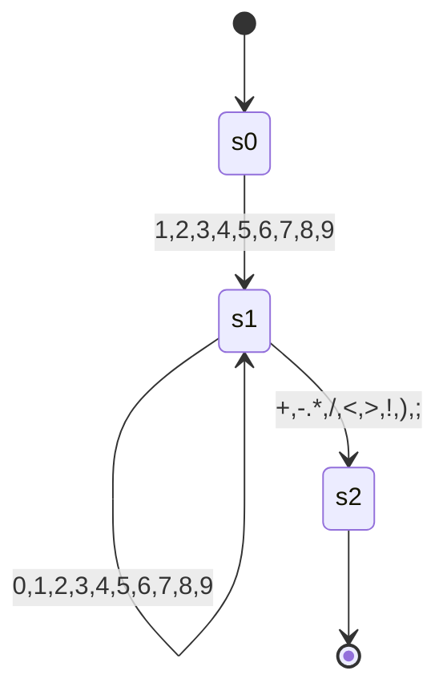

<!-- TOC -->
* [Faul-Lang compiler](#faul-lang-compiler)
  * [Aufbau](#aufbau)
    * [Vision](#vision)
    * [Token](#token)
      * [Basic](#basic)
      * [Keywords](#keywords)
      * [Operatoren](#operatoren)
  * [Parser Regeln (Grammatik)](#parser-regeln-grammatik)
  * [Finite State Machines](#finite-state-machines)
    * [Integer](#integer)
    * [Word](#word)
  * [Todo](#todo)
<!-- TOC -->
# Faul-Lang compiler
Ein kleiner compiler, der faul-lang in mips assembler übersetzt.

## Aufbau
### Vision
Es soll erstmal zwei Datentypen geben, integer (int) und boolean (bool).

Damit soll möglich sein einfach Statements zu formulieren:
```
    int a = 3 + 5;
    int d = 3 * a:
    
    bool b = true;
    bool c = !b
```
Statements werden durch ein Semicolon terminiert.

Block-Statements sind auch geplant. Zunächst soll dies nur `if` beinhalten.

### Token
Tokens der Faul-Lang.
#### Basic

| Name              | Beschreibung             |
|-------------------|:-------------------------|
| EOF               | Ende des Inputs          |
| SEMICOLON         | Statements terminator    |
| V_INT             | Ganzzahl                 |
| V_BOOL            | Boolescher Wahrheitswert |
| OPEN_PARENTHESES  | {                        |
| CLOSE_PARENTHESES | }                        |
| IDENT             | Variablenname            |

#### Keywords

| Name | Beschreibung                 |
|------|------------------------------|
| INT  | Zum erstellen eines Integers |
| BOOL | Zum erstellen eines Boolean  |
| IF   | Beginnt ein If-Statement     |

#### Operatoren

| Name          |     Beschreibung      |
|:--------------|:---------------------:|
| EQ            |           =           |
| PLUS          |           +           |
| MINUS         |           -           |
| ASTERISK      |           *           |
| SLASH         |           /           |
| OR            |  \| (Bitweises oder)  |
| AND           |  & (Bitweises  und)   |
| EQEQ          |          ==           | 
| NOTEQ         |          !=           |
| GT            |           >           |
| GTEQ          |          >=           |
| LT            |           <           |
| LTEQ          |          <=           |
| LOR           | \|\| (logischer oder) |
| LAND          |  && (logisches und)   |
| NOT           |           !           |
| OPEN_BRACKET  |           (           |
| CLOSE_BRACKET |           )           |

## Parser Regeln (Grammatik)

Es wird zu bezeichnung der Regeln die Backus-Naur-Form genutzt.

Im spezielleren wird der Syntax benutzt, der hier definiert ist: [BNF Playground](https://bnfplayground.pauliankline.com/?bnf=%3Cprogram%3E%20%20%20%20%20%20%20%20%20%20%20%3A%3A%3D%20%3Cstatement%3E*%0A%3Cstatement%3E%20%20%20%20%20%20%20%20%20%3A%3A%3D%20%22int%22%20%3Cident%3E%20%22%3D%22%20%3Cexpression%3E%20%3Csemi%3E%0A%20%20%20%20%20%20%20%20%20%20%20%20%20%20%20%20%20%20%20%20%20%20%7C%20%22bool%22%20%3Cident%3E%20%22%3D%22%20%3Cexpression%3E%20%3Csemi%3E%0A%20%20%20%20%20%20%20%20%20%20%20%20%20%20%20%20%20%20%20%20%20%20%7C%20%22if%22%20%22(%22%20%3Cexpression%3E%20%22)%22%20%22%7B%22%20%3Cstatement%3E*%20%22%7D%22%0A%20%20%20%20%20%20%20%20%20%20%20%20%20%20%20%20%20%20%20%20%20%20%7C%20%3Cident%3E%20%22%3D%22%20%3Cexpression%3E%20%3Csemi%3E%0A%3Cexpression%3E%20%20%20%20%20%20%20%20%3A%3A%3D%20%3Cequality%3E%0A%3Cequality%3E%20%20%20%20%20%20%20%20%20%20%3A%3A%3D%20%3Ccomparision%3E%20((%22!%3D%22%20%7C%20%22%3D%3D%22)%20%3Cequality%3E)%3F%0A%3Ccomparision%3E%20%20%20%20%20%20%20%3A%3A%3D%20%3CarithmeticExpr%3E%20(%20(%22%3E%22%20%7C%20%22%3E%3D%22%20%7C%20%22%3C%22%20%7C%20%22%3C%3D%22)%20%3Ccomparision%3E)*%0A%3CarithmeticExpr%3E%20%20%20%20%3A%3A%3D%20%3Cterm%3E%20((%20%22%2B%22%20%7C%20%22-%22)%20%3CarithmeticExpr%3E)%3F%0A%3Cterm%3E%20%20%20%20%20%20%20%20%20%20%20%20%20%20%3A%3A%3D%20%3Cunary%3E%20((%22*%22%20%7C%20%22%2F%22)%20%3Cterm%3E)%3F%0A%3Cunary%3E%20%20%20%20%20%20%20%20%20%20%20%20%20%3A%3A%3D%20(%22!%22%20%7C%20%22-%22)%20%3Cunary%3E%0A%20%20%20%20%20%20%20%20%20%20%20%20%20%20%20%20%20%20%20%20%20%20%7C%20%3Cprimary%3E%0A%3Cprimary%3E%20%20%20%20%20%20%20%20%20%20%20%3A%3A%3D%20%3Cvbool%3E%20%7C%20%3Cvint%3E%20%7C%20%3Cident%3E%0A%20%20%20%20%20%20%20%20%20%20%20%20%20%20%20%20%20%20%20%20%20%20%7C%20%22(%22%20%3Cexpression%3E%20%22)%22%0A%3Cvbool%3E%20%20%20%20%20%20%20%20%20%20%20%20%20%3A%3A%3D%20%22true%22%20%7C%20%22false%22%0A%3Cvint%3E%20%20%20%20%20%20%20%20%20%20%20%20%20%20%3A%3A%3D%20%5B1-9%5D%20%5B0-9%5D*%0A%20%20%20%20%20%20%20%20%20%20%20%20%20%20%20%20%20%20%20%20%20%20%7C%20%220%22%0A%3Cident%3E%20%20%20%20%20%20%20%20%20%20%20%20%20%3A%3A%3D%20(%22_%22%20%7C%20%5Ba-z%5D)%20(%22_%22%20%7C%20%5Ba-z%5D%20%7C%20%5B0-9%5D)*%0A%3Csemi%3E%20%20%20%20%20%20%20%20%20%20%20%20%20%20%3A%3A%3D%20%22%3B%22%2B&name=faul-lang).

```
<program>           ::= <statement>*
<statement>         ::= "int" <ident> "=" <expression> <semi>
                      | "bool" <ident> "=" <expression> <semi>
                      | "if" "(" <expression> ")" "{" <statement>* "}"
                      | <ident> "=" <expression> <semi>
<expression>        ::= <equality> ( ("&&" | "||" | "&" | "|") <expression>)
<equality>          ::= <comparision> (("!=" | "==") <equality>)?
<comparision>       ::= <arithmeticExpr> ( (">" | ">=" | "<" | "<=") <comparision>)?
<arithmeticExpr>    ::= <term> (( "+" | "-") <arithmeticExpr>)?
<term>              ::= <unary> (("*" | "/") <term>)?
<unary>             ::= ("!" | "-") <unary>
                      | <primary>
<primary>           ::= <vbool> | <vint> | <ident>
                      | "(" <expression> ")"
<vbool>             ::= "true" | "false"
<vint>              ::= [1-9] [0-9]*
                      | "0"
<ident>             ::= ("_" | [a-z]) ("_" | [a-z] | [0-9])*
<semi>              ::= ";"+
```

## Operatorrangfolge

1. Klammerungen
2. `-` `!`
3. `*` `/`
4. `+` `-`
5. `>` `>=` `<` `<=`
6. `&&` `||` `|` `&`

## Finite State Machines

### Integer


### Word


## Todo
- [X] Lexer
- [x] Parser
- [ ] Typechecking
- [ ] Optimierung
- [ ] Code generation
